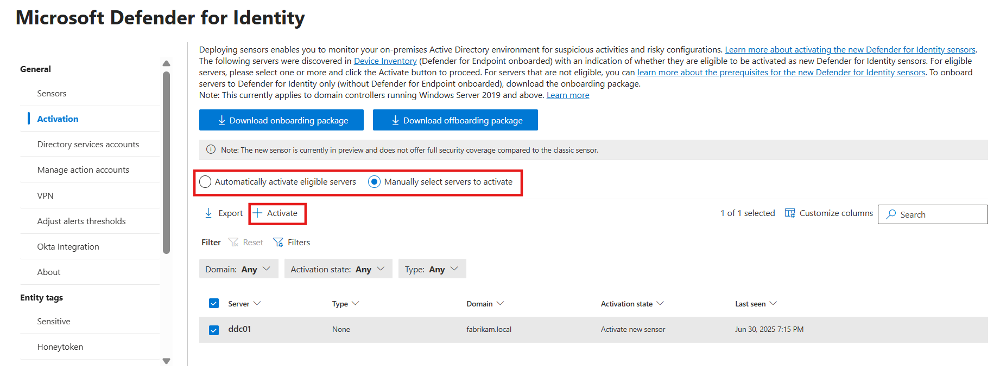
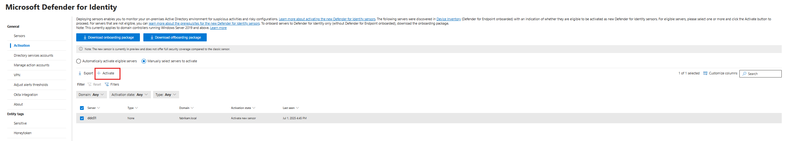
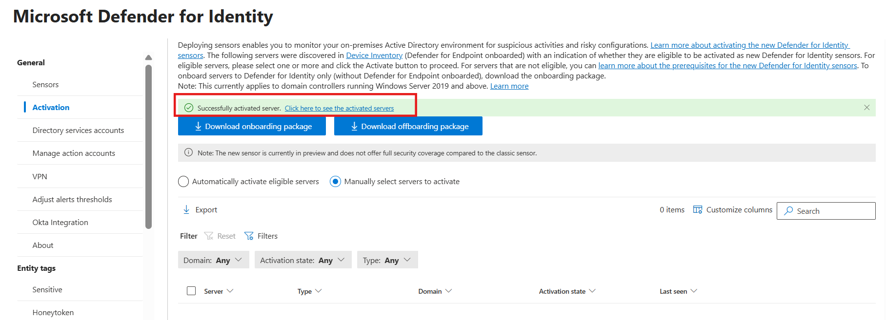
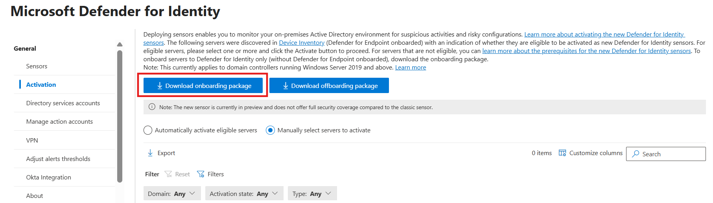
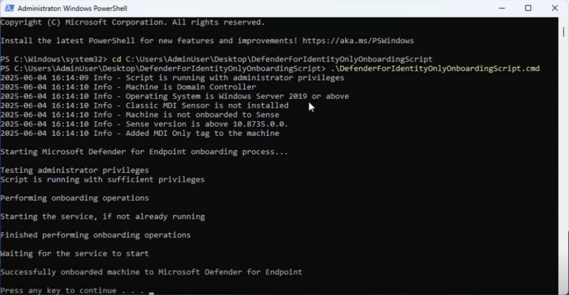

# Activate the Defender for Identity sensor v3.x on a domain controller (Preview)

For complete protection of your on-premises deployment, we recommend activating the Defender for Identity sensor on all applicable servers. This article describes onboarding for new domain controllers running Windows Server 2019 or later. For domain controllers running older operating systems, we recommend [deploying the classic Defender for Identity sensor](install-sensor.md).

## Prerequisites
See [Microsoft Defender for Identity sensor v3.x prerequisites](prerequisites-sensor-version-3.md) for all system requirements before proceeding with activating the sensor.

## The Activation page

The **Activation** page displays all servers from your device inventory. Defender for Identity detects all of your servers and their configuration. The server's activation state lets you know what you need to do to onboard the domain controller to Defender for Identity.

You can choose to activate eligible domain controllers either automatically, where Defender for Identity activates them as soon as they're discovered, or manually, by selecting specific domain controllers from the list of eligible servers.

   

|Activation State  |Next steps  |
|---------|---------|
|Activate new sensor |The domain controller is already onboarded to Defender for Endpoint. [Activate the sensor](#activate-the-defender-for-identity-sensor).|
|Install classic sensor|[Deploy the classic Defender for Identity sensor](install-sensor.md) from the **Sensors page**.|
|OS upgrade is required     |This domain controller is running an unsupported operating system version for the new sensor. Upgrade the OS version to the latest version. |

<!--|Download onboarding package     |[Onboard the domain controller to Defender for Endpoint](#onboard-the-domain-controller).|-->

<!--## The Activation process
The process for activating the sensor depends on your configuration.
- If you have a Defender for Endpoint deployment, simply [activate the sensor](#activate-the-defender-for-identity-sensor).
- If the domain controller is not onboarded to Defender for Endpoint, [onboard the domain controller](#onboard-the-domain-controller) by configuring Defender for Endpoint streamlined URLs, and then downloading and running the onboarding package.-->

## Activate the Defender for Identity sensor

1. In the [Microsoft Defender portal](https://security.microsoft.com), go to **System** > **Settings** > **Identities** > **Activation**.
1. Select the domain controller where you want to activate Defender for Identity, and select **Activate**. Confirm your selection when prompted. 

   

1. When the activation is complete, a green success banner shows. In the banner, select **Click here to see the onboarded servers**. This takes you to the **Sensors** page, where you can check your sensor health.

    

<!--## Onboard the domain controller 

If the domain controller has not been onboarded to Defender for Endpoint for Servers, follow these steps to activate the sensor.

1. [Configure your network environment to ensure connectivity with Defender for Endpoint](/microsoft-365/security/defender-endpoint/configure-environment##enable-access-to-microsoft-defender-for-endpoint-service-urls-in-the-proxy-server) using [streamlined URLs](/microsoft-365/security/defender-endpoint/configure-device-connectivity#option-1-configure-connectivity-using-the-simplified-domain).
1. In the [Microsoft Defender portal](https://security.microsoft.com), go to **System** > **Settings** > **Identities** > **Activation**.
1. Select **Download onboarding package**, and save the file in a location you can access from your domain controller.

   
   
1. From the domain controller, extract the zip file you downloaded from the Microsoft Defender portal.
1. Run the `DefenderForIdentityOnlyOnboardingScript.cmd` script as an administrator.

   

!-->

## Confirm sensor activation 

To confirm the sensor is working: 

1. In the [Microsoft Defender portal](https://security.microsoft.com), go to **System** > **Settings** > **Identities** > **Sensors**.
1. Check that the activated domain controller is listed. 

> [!NOTE]
> The first time you activate the Defender for Identity sensor on your domain controller, it might take up to an hour for the first sensor to show as **Running** on the **Sensors** page. Subsequent activations are shown within five minutes. The activation doesn't require a restart/reboot. 

## Next steps
- [Manage and update Microsoft Defender for Identity sensors](../sensor-settings.md).
