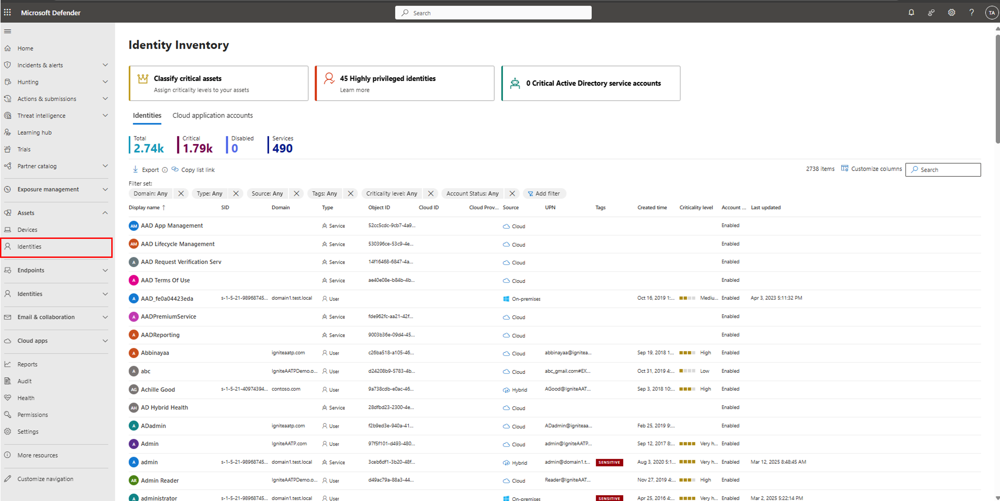

---
# Required metadata
# For more information, see https://review.learn.microsoft.com/en-us/help/platform/learn-editor-add-metadata?branch=main
# For valid values of ms.service, ms.prod, and ms.topic, see https://review.learn.microsoft.com/en-us/help/platform/metadata-taxonomies?branch=main

title: Identity inventory
description: The Identity Inventory provides a centralized location for customers to view and manage identity information across their environment, ensuring optimal visibility and a comprehensive experience. The updated Identities Inventory page is located under Assets in Defender XDR portal.
author:      LiorShapiraa # GitHub alias
ms.author: liorshapira
ms.service: microsoft-defender-for-identity
ms.topic: article
ms.date:     03/13/2025
ms.reviewer: rlitinsky
---

# Identity inventory

__Applies to:__

- [Microsoft Defender for Identity](https://aka.ms/aatp/docs)

- [Microsoft Defender for Cloud Apps](/defender-cloud-apps/)

- [Microsoft Defender XDR](/defender-xdr)

The __Identity inventory__ provides a centralized view of all identities in your organization, enabling you to monitor and manage them efficiently. At a glance, you can see key details such as Domain, Tags, Type, and other attributes, helping you quickly identify and manage identities that require attention.

The Identities inventory page includes the following tabs:

- **Identities**: A consolidated view of identities across Active Directory, Entra ID. This Identities tab highlights key details, including identity types, and user's information.

- **Cloud application accounts:** Displays a list of cloud application accounts, including those from application connectors and third-party sources (original available in the previous version based on Microsoft Defender for Cloud Apps). Learn more about [Cloud application accounts from connected apps.](/defender-cloud-apps/accounts)

There are several options you can choose from to customize the identities list view. On the top navigation you can:

- Add or remove columns.

- Apply filters.

- Search for an identity by name or full UPN, SID, and Object ID. 

- Export the list to a CSV file.

- Copy list link with the included filters configured. 

> [!NOTE]
> When exporting the identities list to a CSV file, a maximum of 5,000 identities are displayed.

## 

### Identity details 

The **Identities** list offers a consolidated view of identities across Active Directory and Microsoft Entra IDs. It highlights key details, including the following columns by default:

- __Display name__ – The full name of the identity as shown in the directory.

- __SID__ – The Security Identifier, a unique value used to identify the identity in Active Directory.

- __Domain__ – The Active Directory domain to which the identity belongs.

- __Object ID__ – A unique identifier for the identity in Microsoft Entra ID.

- __Source__ – Indicates whether the identity is on-premises (originate from Active Directory), Cloud only (Entra ID) or Hybrid (synced from Azure Active Directory to Entra ID).

- __Type__ – Specifies if the identity is a user account or service account.

- __UPN (User Principal Name)__ – The unique login name of the identity in an email-like format.

- __Tags__ – Custom labels that help categorize identities that are considered high value assets. For example, **Sensitive**, **Honeytoken** or **Privileged Accounts** managed by a [Privileged Identity Management](/entra/id-governance/privileged-identity-management/pim-configure) (PIM) service.

- __Created time__ – The timestamp when the identity was first created.

- __Criticality level__ – Indicates the critical level of the identity.

- __Account status__ – Shows whether the identity is enabled or disabled.

- __Last updated__ – The timestamp of the most recent update to the identity's attributes in Active Directory.

Nondefault columns: Email, Microsoft Entra ID risk level and Cloud ID. 

> [!TIP]
> To see all columns, you likely need to do one or more of the following steps:
> - Horizontally scroll in your web browser.
> - Narrow the width of appropriate columns.
> - Zoom out in your web browser.

### Sort and filter the Identities list

You can apply the following filters to limit the list of identities and get a more focused view:

- Domain

- Type

- Source

- Tags

- Criticality level

- Account status

Sort option applies to Display name, Domain, and Created time columns.

### Identity inventory insights 

- The __Classify critical assets__ card allows you to define identity groups as business critical. For more information, see [Microsoft Security Exposure Management](/security-exposure-management/microsoft-security-exposure-management). 

- **Highly privileged identities** card helps you investigate in Advanced hunting all sensitive accounts in your organization, including Microsoft Entra ID security administrators and Global admin users.

- **Critical Active Directory service accounts** card helps you quickly identify all Active Directory accounts designated as critical, making it easier to focus on identities most at risk.

At the top of the page, the following identities counts are available:

- __Total__: The total number of identities. 

- __Critical:__ The number of your critical assets. 

- **Disabled:** The number of all disabled identities in your organization. 

- **Services:** The number of all service accounts both on-premises and cloud.

You can use this information to help you prioritize identities for security posture improvements.

### Navigate to the Identity inventory page

In the Defender XDR portal at [https://security.microsoft.com](https://security.microsoft.com), go to **Assets** > **Identities**. Or, to navigate directly to the [identity inventory](/defender-for-identity/identity-inventory) page.

### Related Articles

- [Investigate cloud application accounts](/defender-cloud-apps/accounts)

- [Investigate users in Microsoft Defender XDR](/defender-xdr/investigate-users) 

- [Investigate assets in Microsoft Defender for Identity](/defender-for-identity/investigate-assets)

