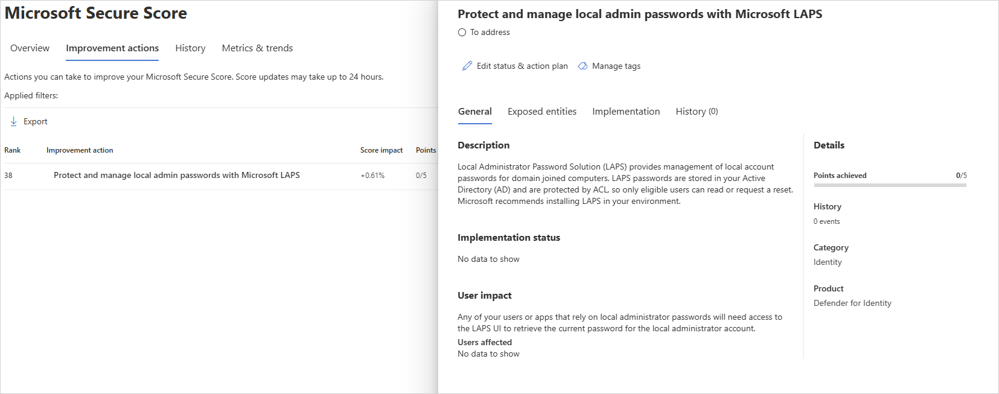
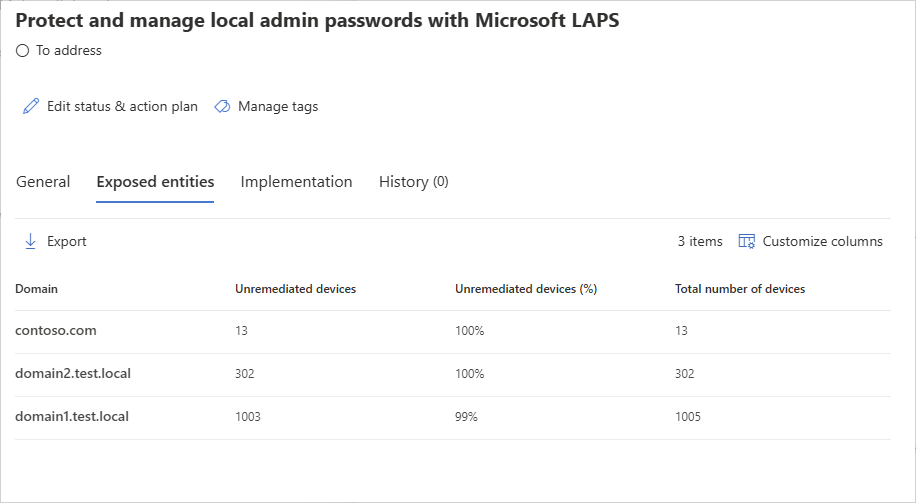
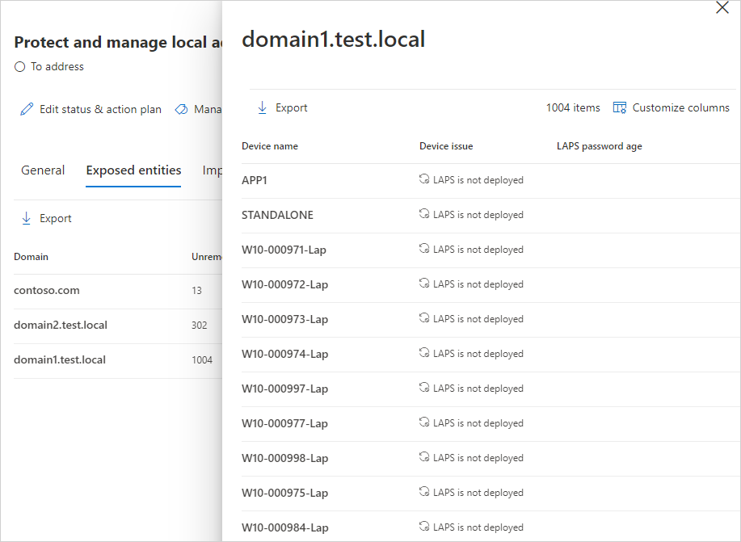

# Security assessment: Microsoft LAPS usage

## What is Microsoft LAPS?

Microsoft's "Local Administrator Password Solution" (LAPS) provides management of local administrator account passwords for domain-joined computers. Passwords are randomized and stored in Active Directory (AD), protected by ACLs, so only eligible users can read it or request its reset.

This security assessment supports [legacy Microsoft LAPS](https://www.microsoft.com/en-us/download/details.aspx?id=46899) and [Windows LAPS](/windows-server/identity/laps/laps-overview).

## What risk does not implement LAPS pose to an organization?

LAPS provides a solution to the issue of using a common local account with an identical password on every computer in a domain. LAPS resolves this issue by setting a different, rotated random password for the common local administrator account on every computer in the domain.

LAPS simplifies password management while helping customers implement more recommended defenses against cyberattacks. In particular, the solution mitigates the risk of lateral escalation that results when customers use the same administrative local account and password combination on their computers. LAPS stores the password for each computer's local administrator account in AD, secured in a confidential attribute in the computer's corresponding AD object. The computer can update its own password data in AD, and domain administrators can grant read access to authorized users or groups, such as workstation helpdesk administrators.

> [!NOTE]
> In some cases, [Microsoft Entra hybrid joined](/azure/active-directory/devices/concept-hybrid-join) machines may still appear in the security posture assessment even if LAPS is configured in Microsoft Entra ID. This can be due to how the policy is applied or how the device reports its state.
> If this occurs, we suggest reviewing the LAPS configuration in Microsoft Entra ID to confirm everything is set up as expected. You can find more details [here](https://techcommunity.microsoft.com/blog/microsoft-entra-blog/windows-local-administrator-password-solution-with-microsoft-entra-id-now-genera/3911999).

## How do I use this security assessment?

1. Review the recommended action at <https://security.microsoft.com/securescore?viewid=actions> to discover which of your domains have some (or all) compatible Windows devices that aren't protected by LAPS, or that haven't had their LAPS managed password changed in the last 60 days.

   
   
1. For domains that are partially protected, select the relevant row to view the list of devices not protected by LAPS in that domain.

    
   
1. Take appropriate action on those devices by downloading, installing, and configuring or troubleshooting [Microsoft LAPS](https://go.microsoft.com/fwlink/?linkid=2104282) or [Windows LAPS](/windows-server/identity/laps/laps-overview). 

    
   
> [!NOTE]
> While assessments are updated in near real time, scores and statuses are updated every 24 hours.  While the list of impacted entities is updated within a few minutes of your implementing the recommendations, the status may still take time until it will be marked as **Completed**.

## See also

- [Learn more about Microsoft Secure Score](/microsoft-365/security/defender/microsoft-secure-score)

