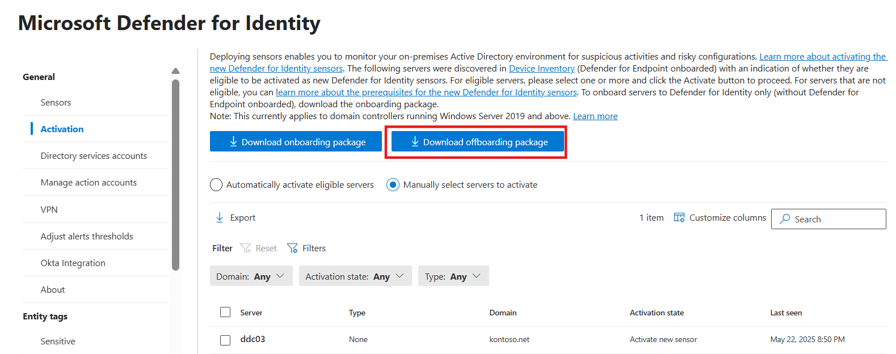
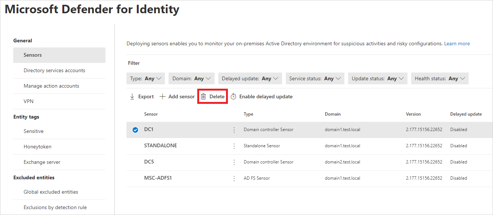

# Remove the Microsoft Defender for Identity sensor

This article describes how to uninstall the Microsoft Defender for Identity sensor from domain controllers.

<!--## Prerequisites

Deactivating Defender for Identity capabilities from your domain controller doesn't remove the domain controller from Defender for Endpoint. You must remove Defender for Identity from Defender for Endpoint before deactivating the sensor.

1. In the [Defender portal](https://security.microsoft.com), go to **Settings** > **Identities** > **Activation**.
1. Select **Download offboarding package** and save the file in a location you can access from your domain controller.  

1. From the domain controller, extract the zip file, and run the `DefenderForIdentityOnlyOffboardingScript_valid_until_YYYY-MM-DD.cmd` script as an Administrator.
-->

## Delete a sensor

### For sensor v3.x
1. In the [Microsoft Defender portal](https://security.microsoft.com), go to **Settings** > **Identities** > **Sensors**.
2. Select the domain controller where you want to deactivate Defender for Identity capabilities, select **Delete**, and confirm your selection.

   :::image type="content" source="media/screenshot-that-shows-how-to-delete-a-sensor.png" alt-text="Screenshot that shows how to delete a sensor." lightbox="media/screenshot-that-shows-how-to-delete-a-sensor.png":::

    >[!NOTE]
    >This action removes the v3.x sensor and stops monitoring on that domain controller.   

## Delete and uninstall a sensor v2.x from a domain controller

> [!IMPORTANT]
> We recommend removing the sensor from the domain controller before demoting the domain controller.
> 
1. Sign in to the domain controller with administrative privileges.
2. From the Windows **Start** menu, select **Settings** > **Control Panel** > **Add/ Remove Programs**.
3. Select the sensor installation, select **Uninstall**, and follow the instructions to remove the sensor.
4. After uninstallation is complete, go to the Microsoft Defender portal > Settings > Identities > Sensors, select the domain controller, and choose Delete.

## Remove an orphaned sensor

A sensor can be orphaned when a domain controller was deleted without first uninstalling the sensor, and the sensor still appears in the Microsoft Defender portal.

1. In the [Defender portal](https://security.microsoft.com), go to **Settings** and then **Identities**. Select **Sensors** on the left to display all your Defender for Identity sensors.
1. Locate the orphaned sensor and select **Delete** (trash can icon).

    

## Remove a duplicate sensor

This scenario may occur after an in-place sensor upgrade, and the sensor appears twice in the Microsoft Defender portal.

1. In [Defender portal](https://security.microsoft.com), go to **Settings** and then **Identities**. Select **Sensors** on the left to display all your Defender for Identity sensors.
1. Locate the duplicate sensor. It will be the one whose status is set to **Unknown**. Then, at the end of the row, select **Delete** (trash can icon).

## Uninstall the Defender for Identity sensor silently

Use the following command to perform a silent uninstall of the Defender for Identity sensor:

**Syntax**:

```cmd
"Azure ATP sensor Setup.exe" [/quiet] [/Uninstall] [/Help]
```

**Installation options**:

> [!div class="mx-tableFixed"]
>
> |Name|Syntax|Mandatory for silent uninstallation?|Description|
> |-------------|----------|---------|---------|
> |Quiet|/quiet|Yes|Runs the uninstaller displaying no UI and no prompts.|
> |Uninstall|/uninstall|Yes|Runs the silent uninstallation of the Defender for Identity sensor from the server.|
> |Help|/help|No|Provides help and quick reference. Displays the correct use of the setup command including a list of all options and behaviors.|

**Examples**:

To silently uninstall the Defender for Identity sensor from the server:

```cmd
"Azure ATP sensor Setup.exe" /quiet /uninstall
```

## See also

- [Manage and update Microsoft Defender for Identity sensors](sensor-settings.md)
