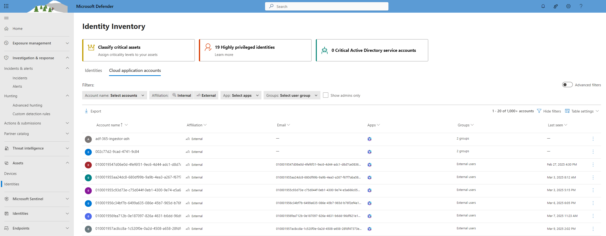
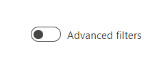
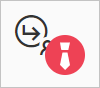

# Cloud Application Accounts

Microsoft Defender for Cloud Apps gives you visibility into the accounts from your connected applications. After you connect Defender for Cloud Apps to an app using the [App connector](/defender-cloud-apps/enable-instant-visibility-protection-and-governance-actions-for-your-apps), Defender for Cloud Apps reads account information associated with connected applications. The Cloud application accounts tab within the Identity inventory enables you to investigate those accounts, permissions, the groups they're members of, their aliases, and the apps they're using. Additionally, when Defender for Cloud Apps detects a new account that wasn't previously seen in one of the connected apps - for example, in activities or file sharing - the account is added to the accounts list of that app. This enables you to have visibility into the activity of external users interacting with your cloud apps.

## Identity Inventory

The visibility into cloud application accounts, as described above, is provided in the Identity Inventory under the "**Cloud application accounts**" tab.

The **Identity inventory** provides a centralized view of all identities in your organization, enabling you to monitor and manage them efficiently. At a glance, you can see key details such as Domain, Tags, Type, and other attributes, helping you quickly identify and manage identities that require attention. 

For more details, visit the [Identity Inventory documentation](/defender-for-identity/identity-inventory).

## Cloud Application Accounts

Admins can search for specific account metadata or account activity. The **Cloud application accounts** tab provides comprehensive details about entities pulled from connected cloud applications, including activity history and security alerts related to the account.

The **Cloud application accounts** tab can be filtered to find specific accounts and deep dive into different types of accounts. For example, you can filter for all External accounts that haven't been accessed since last year.

The **Cloud application accounts** tab enables easy investigation of accounts, including:

- Checking if any accounts have been inactive in a particular service for a long time (consider revoking the license for that user to that service).

- Filtering for accounts with admin permissions.

- Searching for accounts that are no longer part of your organization but may still have active accounts.

- Taking governance actions on accounts, such as suspending an app or accessing the account settings page.

- Viewing which accounts are included in each user group.

- Seeing which apps are accessed by each account and which apps are deleted for specific accounts.

### Accounts filters

The Cloud application accounts tab offers comprehensive filtering capabilities, with pre-defined filters for a quick and easy experience.

Admins can also enable the "Advanced filters" toggle to filter by additional attributes or create complex filters that include conditions such as "does not equal."  

Predefined filters include:

- **Account name:** Filter specific accounts.

- **Affiliation:** Internal or External. Set internal accounts under **Settings** by defining the **IP address range of your organization**. Admin accounts are marked with a red tie icon.

    
  
- **App:** Filter for any connected app used by accounts in your organization.

- **Groups:** Filter for members of user groups in Defender for Cloud Apps—both built-in and imported user groups.

- **Show Admins only:** Filter for admin accounts.

### Additional actions

Additional actions for further investigation, such as viewing related activities and incidents, are available through the Cloud application accounts tab. Click the three dots at the end of the relevant account's row to view available actions, or click on the account row to see additional accounts related to a single user. Additional actions are also available via the three dots at the end of the table in this view.

## Next steps

> [!div class="nextstepaction"]
> [Best practices for protecting your organization](best-practices.md)

[!INCLUDE [Open support ticket](includes/support.md)]
