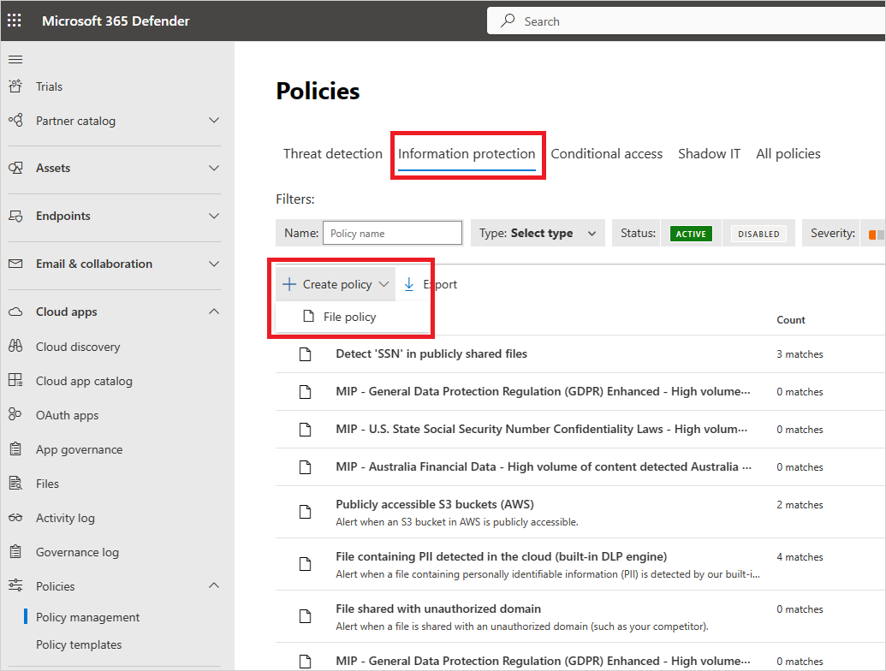
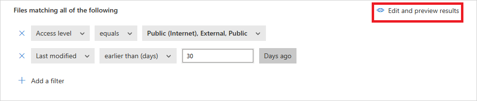

# File policies in Microsoft Defender for Cloud Apps

File Policies allow you to enforce a wide range of automated processes using the cloud provider's APIs. Policies can be set to provide continuous compliance scans, legal eDiscovery tasks, DLP (Data loss prevention) for sensitive content shared publicly, and many more use cases. Defender for Cloud Apps can monitor any file type based on more than 20 metadata filters. For example, access level and file type.

## Supported file types

Defender for Cloud Apps engines perform content inspection by extracting text from (100+) common file types including Office, Open Office, compressed files, various rich text formats, XML, HTML, and more.

## Policies

The engine combines three aspects under each policy:

* Content scan based on preset templates or custom expressions.

* Context filters including user roles, file metadata, sharing level, organizational group integration, collaboration context, and additional customizable attributes.

* Automated actions for governance and remediation.

  > [!NOTE]
  > Only the governance action of the first triggered policy is guaranteed to be applied. For example, if a file policy has a sensitivity label applied to a file, a second file policy can't apply another sensitivity label to it.

Once enabled, the policy continuously scans your cloud environment and identifies files that match the content and context filters, and applies the requested automated actions. These policies detect and remediate any violations for at-rest information or when new content is created. Policies can be monitored using real-time alerts or using console-generated reports.

The following are examples of file policies that can be created:

* **Publicly shared files** - Receive an alert about any file in your cloud that is publicly shared by selecting all files whose sharing level is public.

* **Publicly shared filename contains the organization's name** -
    Receive an alert about any file that contains your organization's name and is publicly shared. Select files with a filename containing the name of your organization and which are publicly shared.

* **Sharing with external domains** - Receive an alert about any file shared with accounts owned by specific external domains. For example, files shared with a competitor's domain. Select the external domain with which you want to limit sharing.

* **Quarantine shared files not modified during the last period** - Receive an alert about shared files that no one modified recently, to quarantine them or choose to turn on an automated action. Exclude all the Private files that  weren't modified during a specified date range. On Google Workspace, you can choose to quarantine these files, using the 'quarantine file' checkbox on the policy creation page.

* **Sharing with unauthorized users** - Receive an alert about files shared with an unauthorized group of users in your organization. Select the users for whom sharing is unauthorized.

* **Sensitive file extension** - Receive an alert about files with specific extensions that are highly exposed. Select the specific extension (for example, crt for certificates) or filename and exclude those files with private sharing level.

## Create a new file policy

To create a new file policy, follow this procedure:

1. In the Microsoft Defender Portal, under **Cloud Apps**, go to **Policies** -> **Policy management**. Select the **Information Protection** tab.

1. Select **Create policy** and select **File policy**.

   
   
1. Give your policy a name and description. You can also base it on a template. For more information about policy templates, see [Control cloud apps with policies](control-cloud-apps-with-policies.md).

1. Assign a **Policy severity** to your policy. If Defender for Cloud Apps is configured to send notifications based on a specific policy severity level, this level determines whether matches for the policy trigger a notification.

1. Select a **Category** and link the policy to the most appropriate risk type. This field is informative only and helps you search for specific policies and alerts later, based on risk type. The risk might already be preselected according to the category for which you chose to create the policy. By default, File policies are set to DLP.

1. **Create a filter for the files this policy will act on** to set which discovered apps trigger this policy. Narrow down the policy filters until you reach an accurate set of files you wish to act upon. Be as restrictive as possible to avoid false positives. For example, if you wish to remove public permissions, remember to add the **Public** filter, if you wish to remove an external user, use the "External" filter and so on.

    > [!NOTE]
    > The file policy,'Contains' filter searches only for complete words. These words must be separated by punctuation marks like commas, dots, hyphens, or spaces.
    > * Spaces or hyphens between words function like OR. For example, if you search for 'malware virus' it finds all files with either malware or virus in the name, so it finds both malware-virus.exe and virus.exe.
    > * If you want to search for a string, enclose the words in quotation marks. This functions like AND. For example, if you search for "malware" "virus," it finds virus-malware-file.exe but it won't find malwarevirusfile.exe and it won't find malware.exe. However, it searches for the exact string. If you search for "malware virus," it won't find "virus" or "virus-malware."\
    > * **Equals** searches only for the complete string. For example, if you search for malware.exe it finds malware.exe but not *malware.exe.txt.*

1. Under the **Apply to** filter, select either **all files**, **all files excluding selected folders** or **selected folders** for Box, SharePoint, Dropbox, or OneDrive. This setting allows you to enforce the file policy across all files in the app or within specific folders. You're then prompted to sign in to the cloud app and add the relevant folders.

    :::image type="content" source="media/file-policies/screenshot-showing-where-to-apply-file-policies-for-example-all-files-or-selected-folders.png" alt-text="Screenshot showing where to apply file policies, for example to all files or selected folders" lightbox="media/file-policies/screenshot-showing-where-to-apply-file-policies-for-example-all-files-or-selected-folders.png":::

1. Under the  **Select user groups** filter, select either **all file owners**, **file owners from selected user groups** or **all file owners excluding selected groups**. Then select the relevant user groups to determine which users and groups should be included in the policy.

1. Select the **Content inspection method**.  We recommend using the [**Data Classification Services**](content-inspection.md).

    Once content inspection is enabled, you can choose to use preset expressions or to search for other customized expressions.

    In addition, you can specify a regular expression to exclude a file from the results. This option is highly useful if you have an inner classification keyword standard that you want to exclude from the policy.

    You can set the minimum number of content violations that you want to match before the file is considered a violation. For example, you can choose 10 if you want to be alerted on files with at least 10 credit card numbers found within its content.

    When content is matched against the selected expression, the violation text is replaced with "X" characters. By default, violations are masked and shown in their context displaying 100 characters before and after the violation. Numbers in the context of the expression are replaced with "#" characters and are never stored within Defender for Cloud Apps. You can select the option to **Unmask the last four characters of a violation** to unmask the last four characters of the violation itself. It's necessary to set which data types the regular expression searches: content, metadata and/or file name. By default it searches the content and the metadata.

1. Choose the **Governance** actions you want Defender for Cloud Apps to take when a match is detected.

1. Once you've created your policy, you can view it by filtering for the **File policy** type. You can always edit a policy, calibrate its filters, or change the automated actions. The policy is automatically enabled upon creation and starts scanning your cloud files immediately. Take extra care when you set governance actions, they could lead to irreversible loss of access permissions to your files. It's recommended to narrow down the filters to exactly represent the files that you wish to act upon, using multiple search fields. The narrower the filters, the better. For guidance, you can use the **Edit and preview results** button next to the filters.

    
   
1. To view file policy matches, files that are suspected to violate the policy, go to **Policies** -> **Policy management**. Filter the results to display only the file policies using the **Type** filter at the top. For more information about the matches for each policy, under the **Count** column, select the number of **matches** for a policy. Alternatively, select the three dots at the end of the row for a policy and choose **View all matches**.  This opens the **File policy report**. Select the **Matching now** tab to see files that currently match the policy. Select the **History** tab to see a history back to up to six months of files that matched the policy.

## Limitations

* You're limited to 50 file policies in Defender for Cloud Apps.

* When you create or edit a file policy, or use the "Edit and preview results" option, there's a query size limitation in place to maintain performance and prevent system overload. If you encounter a query size error, try removing one filter at a time to isolate the issue. Start with the "collaborators" filter, particularly if it includes broad groups like "everyone" or "everyone except external users", which are more likely to exceed the query limit.

## File policy best practices

1. Avoid resetting the file policy using the **Reset results and apply actions again** checkbox in production environments unless it's necessary. Doing so initiates a full scan of all files covered by the policy, which can negatively affect performance.

1. When applying labels to files in a specific parent folder **and** its subfolders, use the **Apply to** -> **Selected folders** option. Then add each of the parent folders.

1. When applying labels to files in a specific folder only (excluding any subfolders), use the file policy filter **Parent Folder** with the **Equals** operator.

1. File policy is faster when narrow filtering criteria are used (as compared to wide criteria).

1. Consolidate several file policies for the same service (such as SharePoint, OneDrive, Box, and so on) to a single policy.

1. When enabling file monitoring (from the **Settings** page), create at least one file policy. When no file policy exists, or is disabled for seven consecutive days, file monitoring is autodisabled.

## File policy reference

This section provides reference details about policies, providing explanations for each policy type and the fields that can be configured for each policy.

A **File policy** is an API-based policy that enables you to control your organization's content in the cloud, taking into account over 20 file metadata filters (including owner and sharing level) and content inspection results. Based on the policy results, governance actions can be applied. The content inspection engine can be extended via 3rd-party DLP engines and anti-malware solutions.

Each policy is composed of the following parts:

* **File filters** – Enable you to create granular conditions based on metadata.

* **Content inspection** – Enable you to narrow down the policy, based on DLP engine results. You can include a custom expression or a preset expression. Exclusions can be set and you can choose the number of matches. You can also use anonymization to mask the username.

* **Actions** – The policy provides a set of governance actions that can be automatically applied when violations are found. These actions are divided into collaboration actions, security actions, and investigation actions.

* **Extensions** - Content inspection can be performed via 3rd-party engines for improved DLP or anti-malware capabilities.

## View file policy results

You can go to the Policy center to review file policy violations.

1. In the Microsoft Defender Portal, under **Cloud Apps**, go to **Policies** -> **Policy management**, and then select the **Information protection** tab.

1. For each file policy, you can see the file policy violations by selecting the **matches**.  

   :::image type="content" alt-text="Screenshot of sample policy matches." source="media/pci-matches.png" lightbox="media/pci-matches.png":::

1. You can select the file itself to get information about the files.  

   :::image type="content" alt-text="Screenshot of sample policy content matches." source="media/pci-content-matches.png" lightbox="media/pci-content-matches.png":::

1. For example, you can select **Collaborators** to see who has access to this file, and you can select **Matches** to see the Social Security numbers. 

   :::image type="content" alt-text="Content matches Social Security numbers." source="media/content-matches-ccn.png" lightbox="media/content-matches-ccn.png":::

## File filters 

File filters allow you to apply specific criteria to your file policies and focus on files that meet conditions such as file type, access level, and share status. This includes file types such as PDF, Office files, RTF, HTML, and code files.

Below is a list of the file filters that can be applied:

:::image type="content" source="media/file-policies/screenshot-showing-different-file-types.png" alt-text="Screenshot showing different file types" lightbox="media/file-policies/screenshot-showing-different-file-types.png":::

**Access level** – Sharing access level; public, external, internal, or private.

- **Internal**- Any files within the Internal domains you set in General setup.
- **External** - Any files saved in locations that aren't within the internal domains you set.
- **Shared** - Files that have a sharing level above private. Shared includes:
    - Internal sharing - Files shared within your internal domains.
    - External sharing - Files shared in domains that aren't listed in your internal domains.
    - Public with a link - Files that can be shared with anyone via a link.
    - Public - Files that can be found by searching the Internet.

> [!NOTE]
> Files shared into your connected storage apps by external users are handled as follows by Defender for Cloud Apps:
> - **OneDrive:** OneDrive assigns an internal user as the owner of any file placed into your OneDrive by an external user. Because these files are then considered owned by your organization, Defender for Cloud Apps scans these files and applies policies as it does to any other file in your OneDrive.
> - **Google Drive:** Google Drive considers these files owned by the external user. Due to legal restrictions on files and data that your organization doesn't own, Defender for Cloud Apps doesn't have access to these files.
> - **Box:** Because Box considers externally owned files to be private information, Box Global Admins can't see the content of the files. For this reason, Defender for Cloud Apps doesn't have access to these files.
> - **Dropbox:** Because Dropbox considers externally owned files to be private information, Dropbox Global Admins can't see the content of the files. For this reason, Defender for Cloud Apps doesn't have access to these files.

* **App** – Search only for files within these apps.

* **Collaborators** – Include/exclude specific collaborators or groups. 

* **Any from domain** – If any user from this domain has direct access to the file.
> [!NOTE]
> - This filter doesn't support files that were shared with a group, only with specific users.
> - This filter doesn't support files shared with a specific user through a shared link for SharePoint and OneDrive.

  - **Entire organization** – If the entire organization has access to the file.

  - **Groups** – If a specific group has access to the file. Groups can be imported from Active Directory, cloud apps or manually created in the service.

>[!NOTE]
> - This filter is used to search for a collaborator group as a whole. It doesn't match for individual group members.

  - **Users** – Certain set of users that might have access to the file.

- **Created** – File creation time. The filter supports before/after dates and a date range.

- **Extension** – Focus on specific file extensions. For example, all files that are executables (*.exe). This filter is case sensitive. Use the OR clause to apply the filter on more than a single capitalization variation.

- **File ID** – Search for specific file IDs. File ID is an advanced feature that allows you to track certain high-value files without a dependency on owner, location, or name.

- **File name** – File name or sub string of the name as defined in the cloud app. For example, all files with a password in their name.

- **Sensitivity label** - Search for files with specific labels set. If this filter is used in a file policy, the policy applies to Microsoft Office files only, and ignores other file types.
Labels include:
  - **Microsoft Purview Information Protection** - Requires integration with Microsoft Purview Information Protection.
   - **Defender for Cloud Apps** - Provides more insight into the files it scans. For each file scanned by Defender for Cloud Apps DLP, you can know if inspection was blocked because the file is encrypted or corrupted. For example, you can set up policies to alert and quarantine password-protected files that are shared externally.
       - **Azure RMS encrypted** – Files whose content wasn't inspected because they have an Azure RMS encryption set.
    - **Password encrypted** – Files whose content wasn't inspected because they're password protected by the user.
    - **Corrupt file** – Files whose content wasn't inspected because their contents couldn't be read.

- **File type** – Defender for Cloud Apps scans the file to determine whether the true file type matches the MIME type received (see table) from the service. This scan is for files that are relevant for data scan (documents, images, presentations, spreadsheets, text, and zip/archive files). The filter works per file/folder type. For example, *All folders that are ...* or *All spreadsheet files that are...*

| MIME type | File type |
|--|--|
| - application/vnd.openxmlformats-officedocument.wordprocessingml.document - application/vnd.ms-word.document.macroEnabled.12 - application/msword - application/vnd.oasis.opendocument.text - application/vnd.stardivision.writer - application/vnd.stardivision.writer-global - application/vnd.sun.xml.writer - application/vnd.stardivision.math - application/vnd.stardivision.chart - application/x-starwriter - application/x-stardraw - application/x-starmath - application/x-starchart - application/vnd.google-apps.document - application/vnd.google-apps.kix - application/pdf - application/x-pdf - application/vnd.box.webdoc - application/vnd.box.boxnote - application/vnd.jive.document - text/rtf - application/rtf | Document |
| - application/vnd.oasis.opendocument.image - application/vnd.google-apps.photo - **starts with:** image/ | Image |
| - application/vnd.openxmlformats-officedocument.presentationml.presentation - application/vnd.ms-powerpoint.template.macroEnabled.12 - application/mspowerpoint - application/powerpoint - application/vnd.ms-powerpoint - application/x-mspowerpoint - application/mspowerpoint - application/vnd.ms-powerpoint - application/vnd.oasis.opendocument.presentation - application/vnd.sun.xml.impress - application/vnd.stardivision.impress - application/x-starimpress - application/vnd.google-apps.presentation | Presentation |
| - application/vnd.openxmlformats-officedocument.spreadsheetml.sheet - application/vnd.ms-excel.sheet.macroEnabled.12 - application/excel - application/vnd.ms-excel - application/x-excel - application/x-msexcel - application/vnd.oasis.opendocument.spreadsheet - application/vnd.sun.xml.calc - application/vnd.stardivision.calc - application/x-starcalc - application/vnd.google-apps.spreadsheet | Spreadsheet |
| - **starts with:** text/ | Text |
| All other file MIME types | Other |

- **In trash** – Exclude/include files in the trash folder. These files might still be shared and pose a risk. This filter doesn't apply to files on SharePoint and OneDrive.

:::image type="content" source="media/file-policies/screenshot-showing-multiple-file-filters.png" alt-text="Screenshot showing multiple filter types for file policies" lightbox="media/file-policies/screenshot-showing-multiple-file-filters.png":::

- **Last modified** – File modification time. The filter supports before and after dates, date range, and relative time expressions. For example, all files that weren't modified in the last six months.

- **Matched policy** - Files that are matched by an active Defender for Cloud Apps policy.

- **MIME type** – File Multipurpose Internet Mail Extensions (MIME) type check. It accepts free text.

- **Owner** -Include/exclude specific file owners. For example, track all files shared by *rogue_employee_#100*.

- **Owner OU** – Include or exclude file owners that belong to certain organizational units. For example, all public files except files shared by *EMEA_marketing*. Applies only to files stored in Google Drive.

- **Parent folder** – Include or exclude a specific folder (doesn't apply to subfolders). For example, all publicly shared files except for files in this folder.

  > [!NOTE]
  > Defender for Cloud Apps only detects new SharePoint and OneDrive folders after some file activity occurs in them.
- **Quarantined** – If the file quarantined by the service. For example, show me all files that are quarantined.

## Authorizing files

After Defender for Cloud Apps identifies files as posing a malware or DLP risk, we recommend you investigate the files. If you determine the files are safe, you can authorize them. Authorizing a file removes it from the malware detection report and suppresses future matches on this file.

### To authorize files

1. In the Microsoft Defender Portal, under **Cloud Apps**, select **Policies** -> **Policy management**. Select the **Information protection** tab.
1. In the list of policies, on the row in which the policy that triggered the investigation appears, in the **Count** column, select the **matches** link.

    > [!TIP]
    > You can filter the list of policies by type. The following table lists, per risk type, which filter type to use:
    >
    > | Risk type | Filter type |
    > | --- | --- |
    > | DLP | File policy |
    > | Malware | Malware detection policy |
   
1. In the list of matched files, on the row in which the file under investigation appears, select the ✓ to **Authorize**.

## Working with the File drawer

You can view more information about each file, by selecting the file itself in the file log. Selecting a file opens the **File drawer** which provides the following actions you can take on the file:

- **URL** - Takes you to the file location.
- **File identifiers** - Opens a pop-up with raw data details about the file including file ID and encryption keys when they're available.
- **Owner** - View the user page for the owner of this file.
- **Matched policies** - See a list of policies the file matched.
- **Sensitivity labels** - View the list of sensitivity labels from Microsoft Purview Information Protection found in this file. You can then filter by all files matching this label.

The fields in the File drawer provide contextual links to files and drill downs you might want to perform from the drawer directly. For example, if you move your cursor next to the **Owner** field, you can use the "add to filter" icon  to add the owner immediately to the filter of the current page. You can also use the settings cog icon  that pops up to arrive directly at the settings page necessary to modify the configuration of one of the fields, such as **Sensitivity labels**.

:::image type="content" source="media/file-policies/file-drawer.png" alt-text="Screenshot showing the file drawer" lightbox="media/file-policies/file-drawer.png":::

For a list of governance actions available, see [File governance actions](governance-actions.md#file-governance-actions).

## Related videos

> [!div class="nextstepaction"]
> [Information protection webinar](webinars.md#on-demand-webinars)

## Next steps

> [!div class="nextstepaction"]
> [Best practices for protecting your organization](best-practices.md)

[!INCLUDE [Open support ticket](includes/support.md)]
