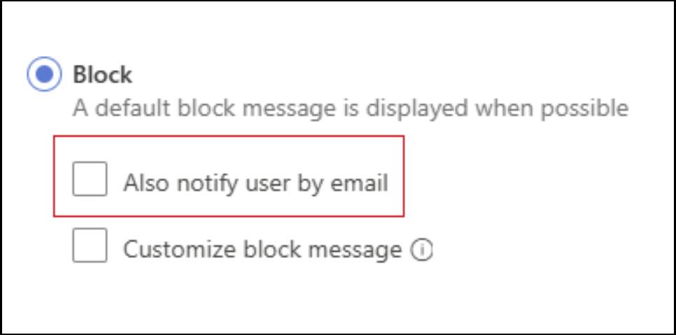

# What's new in Microsoft Defender for Cloud Apps

>
*Applies to: Microsoft Defender for Cloud Apps*

This article is updated frequently to let you know what's new in the latest release of Microsoft Defender for Cloud Apps.

For more information on what's new with other Microsoft Defender security products, see:

- [What's new in Microsoft Defender XDR](/microsoft-365/security/defender/whats-new)
- [What's new in Microsoft Defender for Endpoint](/microsoft-365/security/defender-endpoint/whats-new-in-microsoft-defender-endpoint)
- [What's new in Microsoft Defender for Identity](/defender-for-identity/whats-new)

For news about earlier releases, see [Archive of past updates for Microsoft Defender for Cloud Apps](release-note-archive.md).

## July 2025

### App Governance available in 8 new regions

App Governance is now also available in Brazil, Sweden, Norway, Switzerland, South Africa, South Korea, Arab Emirates and Asia Pacific. For more details, see [Turn on app governance for Microsoft Defender for Cloud Apps](/defender-cloud-apps/app-governance-get-started).

### Updated network requirements for GCC and Gov customers

To support ongoing security enhancements and maintain service availability, Microsoft Defender for Cloud Apps now requires updated firewall configurations for customers in GCC and Gov environments.

To avoid service disruption, take action by **August 25, 2025**, and update your firewall configuration as follows:

Allow outbound traffic on port 443 to the following IP ranges:
  - `51.54.53.136/29`
  - `51.54.114.160/29`
  - `62.11.173.176/29`

If you're using Azure service tags, add `AzureFrontDoor.MicrosoftSecurity` to your firewall allowlist.

Add the following endpoint to your firewall allowlist on port 443:
  - `discoveryresources-cdn-prod.cloudappsecurity.com`

For the full list of required IP addresses and endpoints, see [Network requirements](network-requirements.md#portal-access).

## June 2025

### “Behaviors” data type in Microsoft Defender for Cloud Apps - General Availability

The **Behaviors** data type enhances overall threat detection accuracy by reducing alerts on generic anomalies and surfacing alerts only when observed patterns align with real security scenarios. You can now use **Behaviors** to conduct investigations in [Advanced Hunting](/defender-xdr/advanced-hunting-overview), build better [custom detections](/defender-xdr/custom-detection-rules) based on behavioral signals, and benefit from automatic inclusion of context-related behaviors into [incidents](/defender-xdr/incidents-overview). This provides clearer context and helps security operations teams to reduce alert fatigue, prioritize, and respond more efficiently.

For more information, see:
- [Investigate behaviors with advanced hunting](/defender-cloud-apps/behaviors).
- [TechCommunity Blog](https://techcommunity.microsoft.com/blog/microsoftthreatprotectionblog/transform-the-way-you-investigate-by-using-behaviors--new-detections-in-xdr-star/3825154).

### New Dynamic Threat Detection model

Microsoft Defender for Cloud Apps new dynamic threat detection model continuously adapts to the ever-changing SaaS apps threat landscape. This approach ensures your organization remains protected with up-to-date detection logic without the need for manual policy updates or reconfiguration. Several legacy anomaly detection policies have already been seamlessly transitioned to this adaptive model, delivering smarter and more responsive security coverage.

For more information, see [Create Defender for Cloud Apps anomaly detection policies](anomaly-detection-policy.md).

## May 2025 

### Revamped Cloud Discovery Executive Summary report

The Cloud Discovery Executive Summary report has been updated with a modernized design and streamlined format. The new version reduces the report from 26 pages to 6 pages, focusing on the most relevant and actionable insights while improving readability and usability. For more details, see [How to generate a Cloud Discovery executive report](discovered-apps.md#generate-a-cloud-discovery-executive-report).

### New Applications inventory page now available in Defender XDR

The new Applications page in Microsoft Defender XDR provides a unified inventory of all SaaS and connected OAuth applications across your environment. This view helps streamline application discovery, monitoring, and risk assessment.

For more information, see [Application inventory overview](applications-inventory.md).

### Changes to Microsoft Defender for Cloud Apps SIEM agent availability

As part of our ongoing convergence process across Microsoft Defender workloads, [Microsoft Defender for Cloud Apps SIEM agents](siem.md) will be deprecated starting November 2025.

To ensure continuity and access to data currently available through Microsoft Defender for Cloud Apps SIEM agents, we recommend transitioning to the following supported APIs:
- For alerts and activities, see: [Microsoft Defender XDR Streaming API](/defender-xdr/streaming-api).
- For Microsoft Entra ID Protection logon events, see [IdentityLogonEvents](/defender-xdr/advanced-hunting-identitylogonevents-table) table in the advanced hunting schema. 
- For Microsoft Graph Security Alerts API, see: [List alerts_v2](/graph/api/security-list-alerts_v2?view=graph-rest-1.0&tabs=http&preserve-view=true)
- To view Microsoft Defender for Cloud Apps alerts data in the Microsoft Defender XDR incidents API, see [Microsoft Defender XDR incidents APIs and the incidents resource type](/graph/api/security-list-alerts_v2?view=graph-rest-1.0&tabs=http&preserve-view=true)

For detailed guidance see: [Migrate from Defender for Cloud Apps SIEM agent to supported APIs](migrate-to-supported-api-solutions.md)

### New and improved Cloud App Catalog page

The Cloud app catalog page has been revamped to meet security standards. The new design includes improved navigation, making it easier for you to discover and manage your cloud applications.

For more information, see: [Find your cloud app and calculate risk scores](risk-score.md).

## April 2025

### Firewall configuration update required by April 29, 2025

**Take Immediate Action by April, 29 2025**, to ensure optimal service quality and prevent the interruption of some services. This change will only affect your organization if you're using a firewall allowlist that restricts outbound traffic based on IP addresses or Azure service tags. Update your firewall rules to allow outbound traffic on port 443 for the following IP addresses: 13.107.228.0/24, 13.107.229.0/24, 13.107.219.0/24, 13.107.227.0/24, 150.171.97.0/24. Alternatively use as an additional Azure service tag, ‘AzureFrontDoor.MicrosoftSecurity’, that will be adjusted to reflect the above range by April 28, 2025.\
- This update should be completed and the IP addresses or new Azure service tag added to your firewall's allowlist by April 29, 2025.
-  This change only affects commercial customers of Microsoft Defender for Cloud Apps. Customers connected to the Gov US1 or GCC datacenters won't be affected.\
- Learn more: [Network requirements](https://aka.ms/MDANetworkDocs).

### OAuth app information is now available in attack paths (Preview)

The Security Exposure Management platform now includes OAuth applications as part of the attack path and attack surface map experiences. This enhancement enables you to visualize how attackers could exploit OAuth apps to move laterally within your environment and access critical assets. By identifying these attack paths and investigating associated permissions, you can reduce exposure and improve the security posture of your Microsoft 365 services.

For more information, see [Investigate OAuth application attack paths in Defender for Cloud Apps (Preview)](attack-paths.md)

### OAuthAppInfo table added to Defender XDR advanced hunting (Preview)

The [OAuthAppInfo](/defender-xdr/advanced-hunting-oauthappinfo-table) table is now available in Defender XDR advanced hunting, enabling security teams to explore and analyze OAuth app-related metadata with enhanced visibility.

This table provides details on Microsoft 365-connected OAuth applications that are registered with Microsoft Entra ID and accessible through the Defender for Cloud Apps app governance capability.

### New Applications page in Defender XDR (Preview)

The new Applications page consolidates all SaaS and connected OAuth applications into a single, unified inventory. This centralized view streamlines application discovery, monitoring, and management, providing greater visibility and control across your environment.

The page surfaces key insights such as risk scores, usage patterns, publisher verification status, and privilege levels. These insights help you quickly identify and address high-risk or untagged applications.

For more information, see [Application inventory overview](applications-inventory.md)

## March 2025

### Enhanced Identity Inventory (Preview)

The Identities page under *Assets* has been updated to provide better visibility and management of identities across your environment. The updated Identities Inventory page now includes the following tabs:

- Identities: A consolidated view of identities across Active Directory, Entra ID. This Identities tab highlights key details, including identity types, and user's information.

- Cloud application accounts: Provides insights into accounts from connected applications via Defender for Cloud Apps, allowing investigation of account permissions, group memberships, aliases, and the applications in use.

For more information, see [Identity inventory details](/defender-for-identity/identity-inventory), [Cloud application accounts](/defender-cloud-apps/accounts).

### Role-Based Access Control scoping for "Behaviors" (Preview)

Defender for Cloud Apps customers can now configure Role-Based Access Control (RBAC) scoping for 'Behaviors.' This new capability allows administrators to define and manage access permissions more precisely. Administrators can ensure that users have the appropriate level of access to specific application data based on their roles and responsibilities. By using RBAC scoping, organizations can enhance their security posture, streamline operations, and reduce the risk of unauthorized access.

For more information, see:

- [Configure admin access](/defender-cloud-apps/manage-admins)
- [Investigate behaviors with advanced hunting](/defender-cloud-apps/behaviors)

## February 2025
 
 ### Enhanced Visibility into OAuth Apps Connected to Microsoft 365 - General Availability
 
 Defender for Cloud Apps users who use app governance are able to gain visibility into the origin of OAuth apps connected to Microsoft 365. You can filter and monitor apps that have external origins, to proactively review such apps and improve the security posture of the organization.
 
 The new *Permissions filter and export capabilities allow you to quickly identify apps with specific permissions to access Microsoft 365.
 
 You can now get granular insights into data accessed by apps using legacy EWS API alongside Microsoft Graph. The enhanced coverage of data usage insights enables you to get deeper visibility into apps accessing emails using legacy EWS API.
 
 We're also expanding the coverage of privilege level feature for all popular Microsoft first-party API permissions. The enhanced coverage of privilege level classification enables you to view and monitor apps with powerful permissions into legacy and other non-Graph APIs that have access to Microsoft 365.
 
 For more information, see [detailed insights into OAuth apps](/defender-cloud-apps/app-governance-visibility-insights-view-apps#getting-detailed-information-on-an-app).
 
 ### Enhanced alert source accuracy
 
 Microsoft Defender for Cloud Apps is enhancing its alert sources to deliver more precise information. This update, applicable to new alerts only, are reflected across various experiences and APIs, including the Defender XDR portal, Advanced hunting, and Graph API.
 Microsoft Defender for Cloud Apps is enhancing its alert sources to deliver more precise information. This update, applicable to new alerts only, are reflected across various experiences and APIs, including the Defender XDR portal, Advanced hunting, and Graph API.
 The goal is to improve the accuracy of alert origins, facilitating better identification, management, and response to alerts.
 
 To learn more about the different alert sources in Defender XDR see the _Alert sources_ section of [Investigate alerts in Microsoft Defender XDR - Microsoft Defender XDR | Microsoft Learn](/defender-xdr/investigate-alerts?tabs=settings)
 
 
 ### Network requirement updates
 
 Microsoft Defender for Cloud Apps has improved its security and performance. Network information in firewalls and additional third-party services must be updated to comply with the new standards. To ensure uninterrupted access to our services you must apply these changes by March 16, 2025.
 Microsoft Defender for Cloud Apps has improved its security and performance. Network information in firewalls and additional third-party services must be updated to comply with the new standards. To ensure uninterrupted access to our services you must apply these changes by March 27, 2025.
 
 To connect to third-party apps and enable Defender for Cloud Apps, use the following IP addresses:
 
 |Data center|IP addresses|DNS name|
 |----|----|----|
 |US1|13.64.26.88, 13.64.29.32, 13.80.125.22, 13.91.91.243, 40.74.1.235, 40.74.6.204, 51.143.58.207, 52.137.89.147, 52.183.75.62, 23.101.201.123, 20.228.186.154|\*.us.portal.cloudappsecurity.com|
 |US2|13.80.125.22, 20.36.222.59, 20.36.222.60, 40.74.1.235, 40.74.6.204, 51.143.58.207, 52.137.89.147, 52.183.75.62, 52.184.165.82, 20.15.114.156, 172.202.90.196|\*.us2.portal.cloudappsecurity.com|
 |US3|13.80.125.22, 40.74.1.235, 40.74.6.204, 40.90.218.196, 40.90.218.198, 51.143.58.207, 52.137.89.147, 52.183.75.62, 20.3.226.231, 4.255.218.227|*.us3.portal.cloudappsecurity.com|
 |EU1|13.80.125.22, 40.74.1.235, 40.74.6.204, 40.119.154.72, 51.143.58.207, 52.137.89.147, 52.157.238.58, 52.174.56.180, 52.183.75.62, 20.71.203.39, 137.116.224.49|\*.eu.portal.cloudappsecurity.com|
 |EU2|13.80.125.22, 40.74.1.235, 40.74.6.204, 40.81.156.154, 40.81.156.156, 51.143.58.207, 52.137.89.147, 52.183.75.62, 20.0.210.84, 20.90.9.64|*.eu2.portal.cloudappsecurity.com|
 |Gov US1|13.72.19.4, 52.227.143.223|*.us1.portal.cloudappsecurity.us|
 |GCC| 52.227.23.181, 52.227.180.126| *.us1.portal.cloudappsecuritygov.com |
 
 
 For **US Government GCC High** customers:
 
 ||IP addresses|DNS name|
 |----|----|----|
 |**Session controls**|US Gov Arizona: 52.244.144.65, 52.244.43.90, 52.244.43.225, 52.244.215.117, 52.235.134.195, 52.126.54.167, 52.126.55.65   US Gov Virginia: 13.72.27.223, 13.72.27.219, 13.72.27.220, 13.72.27.222, 20.141.230.137, 52.235.179.167, 52.235.184.112|\*.mcas-gov.us \*.admin-mcas-gov.us|
 |**Access controls**|US Gov Arizona: 52.244.215.83, 52.244.212.197, 52.127.2.97, 52.126.54.254, 52.126.55.65   US Gov Virginia: 13.72.27.216, 13.72.27.215, 52.127.50.130, 52.235.179.123, 52.245.252.18, 52.245.252.131, 52.245.252.191, 52.245.253.12, 52.245.253.58, 52.245.253.229, 52.245.254.39, 52.245.254.51, 52.245.254.212, 52.245.254.245, 52.235.184.112, 52.235.184.112|\*.access.mcas-gov.us \*.access.cloudappsecurity.us|
 |**SAML proxy**|US Gov Arizona: 20.140.49.129, 52.126.55.65  US Gov Virginia: 52.227.216.80, 52.235.184.112|\*.saml.cloudappsecurity.us|
 
 For **US Government GCC** customers:
 
 ||IP addresses|DNS name|
 |----|----|----|
 |**Session controls**|US Gov Arizona: 52.235.147.86, 52.126.49.55, 52.126.48.233    US Gov Virginia: 52.245.225.0, 52.245.224.229, 52.245.224.234, 52.245.224.228, 20.141.230.215, 52.227.10.254, 52.126.48.233, 52.227.3.207 | \*.mcas-gov.ms \*.admin-mcas-gov.ms|
 |**Access controls** |US Gov Arizona: 52.127.2.97, 52.235.143.220, 52.126.48.233   US Gov Virginia: 52.245.224.235, 52.245.224.227, 52.127.50.130, 52.245.222.168, 52.245.222.172, 52.245.222.180, 52.245.222.209, 52.245.223.38, 52.245.223.72, 52.245.223.177, 52.245.223.181, 52.245.223.182, 52.245.223.190, 23.97.12.140, 52.227.3.207  | \*.access.mcas-gov.ms|
 |**SAML proxy** |US Gov Arizona: 52.126.48.233   US Gov Virginia: 52.227.216.80, 52.126.48.233, 52.227.3.207 | \*.saml.cloudappsecuritygov.com|
 
 To stay up to date on IP ranges, it's recommended to refer to the following Azure service tags for Microsoft Defender for Cloud Apps services. The latest IP ranges are found in the service tag. For more information, see [Azure IP ranges](/azure/virtual-network/service-tags-overview).

## November 2024

### Internal Session Controls application notice

The Enterprise application 'Microsoft Defender for Cloud Apps – Session Controls' is used internally by the Conditional Access App Control service.  
Ensure there's no CA policy restricting access to this application.
For policies that restrict all or certain applications, ensure this application is listed as an exception or confirm that the blocking policy is deliberate.  

For more information, see [Sample: Create Microsoft Entra ID Conditional Access policies for use with Defender for Cloud Apps](session-policy-aad.md#sample-create-microsoft-entra-id-conditional-access-policies-for-use-with-defender-for-cloud-apps).

### Defender for Cloud Apps support for Graph API (preview)

Defender for Cloud Apps customers can now query data about discovered apps via the Graph API. Use the Graph API to customize views and automate flows on the **Discovered apps** page, such as applying filters to view specific data. The API supports [GET](/graph/use-the-api) capabilities only.

For more information, see:

- [Work with discovered apps via Graph API](discovered-apps-api-graph.md)
- [Microsoft Graph API reference for Microsoft Defender for Cloud Apps](/graph/api/resources/security-cloudappdiscovery-overview?view=graph-rest-beta&preserve-view=true)

### SaaS Security initiative in Exposure Management

[Microsoft Security Exposure Management](/security-exposure-management/) offers a focused, metric-driven way of tracking exposure in specific security areas using security [initiatives](/security-exposure-management/initiatives). The "SaaS security initiative" provides a centralized location for all best practices related to SaaS security, categorized into 12 measurable metrics. These metrics are designed to assist in effectively managing and prioritizing the large number of security recommendations.
This capability is General Availability (Worldwide) - Note Microsoft Security Exposure Management data and capabilities are currently unavailable in U.S Government clouds - GCC, GCC High, and DoD

For more information, see [SaaS security initiative](saas-security-initiative.md).

### Visibility into app origin (Preview)

Defender for Cloud Apps users who use app governance will be able to gain visibility into the origin of OAuth apps connected to Microsoft 365. You can filter and monitor apps that have external origins, to proactively review such apps and improve the security posture of the organization.

For more information, see [detailed insights into OAuth apps](/defender-cloud-apps/app-governance-visibility-insights-view-apps#getting-detailed-information-on-an-app).

### Permissions filter and export capabilities (Preview)

Defender for Cloud Apps users who use app governance can utilize the new *Permissions* filter and export capabilities to quickly identify apps with specific permissions to access Microsoft 365. 

For more information, see [filters on app governance](/defender-cloud-apps/app-governance-visibility-insights-get-started#view-app-insights).

### Visibility into privilege level for popular Microsoft first-party APIs (Preview)

Defender for Cloud Apps users who use app governance can now gain visibility into privilege level for all popular Microsoft first-party API permissions. The enhanced coverage of privilege level classification enables you to view and monitor apps with powerful permissions into legacy and other non-Graph APIs that have access to Microsoft 365. 

For more information, see [OAuth app permission related details on app governance](/defender-cloud-apps/app-governance-visibility-insights-view-apps#getting-detailed-information-on-an-app).

### Granular data usage insights into EWS API access (Preview)

Defender for Cloud Apps users who use app governance can now get granular insights into data accessed by apps using legacy EWS API alongside Microsoft Graph. The enhanced coverage of data usage insights enables you to get deeper visibility into apps accessing emails using legacy EWS API.

For more information, see [OAuth app data usage insights on app governance](/defender-cloud-apps/app-governance-visibility-insights-view-apps#getting-detailed-information-on-an-app).

## October 2024

### New anomaly data in advanced hunting CloudAppEvents table

Defender for Cloud Apps users who use advanced hunting in the Microsoft Defender portal, can now utilize the new *LastSeenForUser* and *UncommonForUser* columns for queries and detections rules.  
The new columns are designed to assist you to better __identify uncommon activities__ that might appear suspicious, and allow you to create more accurate custom detections, and investigate any suspicious activities that arise.

For more information, see [Advanced Hunting "CloudAppEvents" Data schema](/microsoft-365/security/defender/advanced-hunting-cloudappevents-table).

### New Conditional Access app control / inline data in advanced hunting CloudAppEvents table

Defender for Cloud Apps users who use advanced hunting in the Microsoft Defender portal can now use the new *AuditSource* and *SessionData* columns for queries and detection rules.
Using this data allows for queries that consider specific audit sources, including access and session control, and queries by specific inline sessions.

For more information, see [Advanced Hunting "CloudAppEvents" Data schema](/microsoft-365/security/defender/advanced-hunting-cloudappevents-table).

### New data in advanced hunting CloudAppEvents table - OAuthAppId

Defender for Cloud Apps users who use advanced hunting in the Microsoft Defender portal can now use the new _OAuthAppId_ column for queries and detection rules.

Using _OAuthAppId_ allows the queries that consider specific OAuth applications, making queries and detection rules more accurate.

For more information, see [Advanced Hunting "CloudAppEvents" Data schema](/microsoft-365/security/defender/advanced-hunting-cloudappevents-table).

## September 2024

### Enforce Microsoft Edge in-browser when accessing business apps

Administrators who understand the power of Microsoft Edge in-browser protection, can now require their users to use Microsoft Edge when accessing corporate resources. 

A primary reason is security, since the barrier to circumventing session controls using Microsoft Edge is higher than with reverse proxy technology.

For more information, see [Enforce Microsoft Edge in-browser protection when accessing business apps](in-browser-protection.md#enforce-microsoft-edge-browser-protection-when-accessing-business-apps).

### Connect Mural to Defender for Cloud Apps (Preview)

Defender for Cloud Apps now supports connections to [Mural](https://www.mural.co/) accounts using app connector APIs, giving your visibility into and control over your organization's Mural use.

For more information, see:

- [How Defender for Cloud Apps helps protect your Mural environment](protect-mural.md)
- [Connect apps to get visibility and control with Microsoft Defender for Cloud Apps](enable-instant-visibility-protection-and-governance-actions-for-your-apps.md)
- [Mural Help Center](https://support.mural.co/s/)

### Removing the ability to email end users about blocked actions

Effective October 1, 2024, we'll discontinue the feature that notifies end users via email when their action is blocked by session policies.

This option ensures that if a user's action is blocked, they get both a browser message and an email notification.

Admins can no longer configure this setting when creating new session policies.

Existing session policies with this setting won't trigger email notifications to end users when a block action occurs.

End users will continue to receive the block message directly through the browser and will stop receiving block notification via email.

Screenshot of the notify end user by email option:

## August 2024

### Reorganized Defender for Cloud Apps documentation

We've reorganized the Microsoft Defender for Cloud Apps documentation to highlight our main product pillars and use cases, and to align with our overall [Microsoft Defender documentation](/defender-xdr).

Use the feedback mechanisms at the top and bottom of each documentation page to send us your comments on Defender for Cloud Apps documentation.

### Large scale export of Activity logs (Preview)

A new user experience dedicated to providing users the option to export from 'activity log' page up to six months back or up to 100K events.

You can filter the results using time range and various other filters and even hide private activities.

For more information, see [Export activities six months back](activity-filters-queries.md#export-activities-six-months-back).

## July 2024
### Configure and embed a custom support URL in Block pages (Preview)

Customize the Microsoft Defender for Cloud Apps(MDA) block experience for apps that are blocked using Cloud Discovery.

You can set up a custom redirect URL on block pages:

- To educate and redirect end users to organization acceptable use policy 
- To guide end users on steps to follow to secure an exception for block

For more information, see [Configure custom URL for MDA block pages](mde-govern.md#educate-users-when-accessing-blocked-apps--customize-the-block-page).

### In-browser protection for macOS users and newly supported policies (Preview)

Microsoft Edge browser users from macOS who are scoped to session policies are now protected with in-browser protection.

The following session policies are now supported:

- Block and Monitor upload of sensitive files
- Block and Monitor paste
- Block and Monitor of malware upload
- Block and Monitor of malware download

See [In-browser protection](in-browser-protection.md).

  In-browser protection is supported with the last two stable versions of Microsoft Edge (for example, if the newest Microsoft Edge is 126, in-browser protection works for v126 and v125). 

See [Microsoft Edge releases](/deployedge/microsoft-edge-release-schedule#microsoft-edge-releases).

## June 2024

### Automatic redirection for the classic Defender for Cloud Apps portal - General Availability

The classic Microsoft Defender for Cloud Apps portal experience and functionality have been converged into the Microsoft Defender XDR Portal. As of June 2024, all customers using the classic Defender for Cloud Apps portal are automatically redirected to Microsoft Defender XDR, with no option to revert back to the classic portal.

For more information, see [Microsoft Defender for Cloud Apps in Microsoft Defender XDR](/microsoft-365/security/defender/microsoft-365-security-center-defender-cloud-apps).

### Microsoft Entra ID apps are automatically onboarded for Conditional Access app control (Preview)

Now, when you're creating access or session policies with Conditional Access app control, your Microsoft Entra ID apps are automatically onboarded and available for you to use in your policies.

When creating your access and session policies, select your apps by filtering for **Automated Azure AD onboarding**, for Microsoft Entra ID apps, or **Manual onboarding**, for non-Microsoft IdP apps.

For example:

:::image type="content" source="media/release-notes/onboarded-apps-filter.png" alt-text="Screenshot of the new App filter for access and session policies.":::

Extra steps for using Conditional Access app control still include:

- **Creating a Microsoft Entra ID Conditional Access policy** for the apps you want to control with Defender for Cloud Apps Conditional Access app control.
- **Manual steps to onboard non-Microsoft IdP apps**, including configuring your IdP to work with Defender for Cloud Apps.

For more information, see:

- [Protect apps with Microsoft Defender for Cloud Apps Conditional Access app control](proxy-intro-aad.md)
- [Conditional Access app control process flow](conditional-access-app-control-how-to-overview.md)
- [Create access policies](access-policy-aad.md)
- [Create session policies](session-policy-aad.md)

### Defender for Cloud Apps discovery on macOS (Preview)

Defender for Cloud Apps now supports cloud app discovery on macOS devices together with the Microsoft Defender for Endpoint integration. Defender for Cloud Apps and Defender for Endpoint together provide a seamless Shadow IT visibility and control solution.

Together with this enhancement, the **Win10 Endpoint Users** option on the **Cloud Discovery** page has been renamed to **Defender-managed endpoints**.

For more information, see:

- [Integrate Microsoft Defender for Endpoint with Microsoft Defender for Cloud Apps](mde-integration.md)
- [Investigate apps discovered by Microsoft Defender for Endpoint](mde-investigation.md)

### AKS supported for automatic log collection (Preview)

Microsoft Defender for Cloud Apps log collector now supports [Azure Kubernetes Service (AKS)](/azure/aks/) when the receiver type is `Syslog-tls`, and you can configure automatic log collection on AKS for continuous reporting with Defender for Cloud Apps.

For more information, see [Configure automatic log upload using Docker on Azure Kubernetes Service (AKS)](discovery-kubernetes.md).

### New Conditional Access app control / inline data for the advanced hunting CloudAppEvents table (Preview)

Defender for Cloud Apps users who use advanced hunting in the Microsoft Defender portal can now use the new *AuditSource* and *SessionData* columns for queries and detection rules. Using this data allows for queries that consider specific audit sources, including access and session control, and queries by specific inline sessions.

For more information, see [Advanced Hunting "CloudAppEvents" Data schema](/microsoft-365/security/defender/advanced-hunting-cloudappevents-table).

### SSPM support for multiple instances of the same app is Generally Available

Defender for Cloud Apps now supports SaaS security posture management (SSPM) across multiple instances of the same app. For example, if you have multiple instances of Okta, you can configure Secure Score recommendations for each instance individually. Each instance shows up as a separate item on the **App Connectors** page. For example:

:::image type="content" source="media/security-saas-choose-secure-score-main-instance.png" alt-text="Screenshot of the Turn on Secure Score recommendations option." lightbox="media/classic-security-saas-choose-secure-score-main-instance.png":::

For more information, see [SaaS security posture management (SSPM)](security-saas.md).

## May 2024

### Defender for Cloud Apps in the Microsoft Defender portal - General Availability and advance notice for redirection

The Defender for Cloud Apps experience in the Microsoft Defender portal is generally available, and the automatic redirection from the classic portal is on by default for all customers. 

Starting June 16, 2024, the redirection toggle will no longer be available. From then on, all users accessing the classic Microsoft Defender for Cloud Apps portal will be automatically rerouted to the Microsoft Defender portal, with no option to opt out.

To prepare for this change, we recommend that any customers still using the classic portal move operations to the Microsoft Defender portal. For more information, see [Microsoft Defender for Cloud Apps in Microsoft Defender XDR](/defender-xdr/microsoft-365-security-center-defender-cloud-apps).

### Turn on preview options in the main Microsoft Defender XDR settings (Preview)

Now, preview customers can manage settings for preview features together with other Microsoft Defender XDR preview features.

Select **Settings > Microsoft Defender XDR > General > Preview** to toggle preview features on or off as needed. For example:

:::image type="content" source="media/release-notes/preview-features.png" alt-text="Screenshot of the Microsoft Defender XDR Preview features settings page.":::

Customers not yet using preview features continue to see the legacy settings under **Settings > Cloud apps > System > Preview** features.

For more information, see [Microsoft Defender XDR preview features](/microsoft-365/security/defender/preview).

### App governance available for government clouds

App governance features in Defender for Cloud Apps are now available in government clouds. For more information, see:

- [App governance in Microsoft Defender for Cloud Apps](app-governance-manage-app-governance.md)
- [Microsoft Defender for Cloud Apps for US Government offerings](editions-cloud-app-security-gcc.md)

## April 2024

### Enable data encryption from the Microsoft Defender portal

Now you can complete the process for encrypting Defender for Cloud Apps data at rest with your own key by enabling data encryption from the **Settings** area of the Microsoft Defender portal.

This feature is now limited on the classic Microsoft Defender for Cloud Apps portal, and is available only from the Microsoft Defender portal.

For more information, see [Encrypt Defender for Cloud Apps data at rest with your own key (BYOK)](ems-cloud-app-security-govt-service-byok.md).

## March 2024

### New log collector version released

We released a new version of a log collector with the latest vulnerability fixes. The new version is `columbus-0.272.0-signed.jar`, and the image name is `mcaspublic.azurecr.io/public/mcas/logcollector`, with the tag `latest/0.272.0`.

Changes include upgrading dependencies, such as:

- amazon-corretto
- ubuntu
- libssl
- oauthlib
- logback
- setuptools

For more information, see [Advanced log collector management](log-collector-advanced-management.md#update-the-log-collector-version).
 
### Podman supported for automatic log collection (Preview)

Microsoft Defender for Cloud Apps log collector now supports [Podman](https://docs.podman.io/en/latest/), and you can configure automatic log collection on Podman for continuous reporting with Defender for Cloud Apps. 

Automatic log collection is supported using a Docker container on multiple operating systems. For Linux distributions using RHEL version 7.1 and higher, you must use Podman as the container's runtime system.

For more information, see [Configure automatic log upload using Podman](discovery-linux-podman.md).

### New anomaly data for the advanced hunting CloudAppEvents table (Preview)

Defender for Cloud Apps users who use advanced hunting in the Microsoft Defender portal can now use the new *LastSeenForUser* and *UncommonForUser* columns for queries and detections rules. Using this data helps to rule out false positives and find anomalies.

For more information, see [Advanced Hunting "CloudAppEvents" Data schema](/microsoft-365/security/defender/advanced-hunting-cloudappevents-table).

### New threat detections for Microsoft Copilot for Microsoft 365

Defender for Cloud Apps now provides new detections for risky user activities in Microsoft Copilot for Microsoft 365 with the Microsoft 365 connector.

- Related alerts are shown together with other Microsoft Defender XDR alerts, in the Microsoft Defender portal.
- Copilot for Microsoft 365 activities is available in the Defender for Cloud Apps activity log.
- In the Microsoft Defender portal's **Advanced hunting** page, Copilot for Microsoft 365 activities are available in the **CloudAppEvents** table, under the **Microsoft Copilot for Microsoft 365** application.

For more information, see:

- [Get started with Microsoft Copilot for Microsoft 365](/microsoft-365-copilot/microsoft-365-copilot-setup)
- [How Defender for Cloud Apps helps protect your Microsoft 365 environment](protect-office-365.md)
- [Investigate alerts in Microsoft Defender XDR](/microsoft-365/security/defender/investigate-alerts)
- [Defender for Cloud Apps Activity log](activity-filters.md)
- [Proactively hunt for threats with advanced hunting](/microsoft-365/security/defender/advanced-hunting-overview)
- [CloudAppEvents table in the advanced hunting schema](/microsoft-365/security/defender/advanced-hunting-cloudappevents-table)

### Data in motion protection for Microsoft Edge for Business users (Preview)

Defender for Cloud Apps users who use Microsoft Edge for Business and are subject to session policies are now protected directly from within the browser. In-browser protection reduces the need for proxies, improving both security and productivity.

Protected users experience a smooth experience with their cloud apps, without latency or app compatibility issues, and with a higher level of security protection.

In-browser protection is turned on by default, and is being gradually rolled out across tenants, starting early in March 2024.

For more information, see [In-browser protection with Microsoft Edge for Business (Preview)](in-browser-protection.md), [Protect apps with Microsoft Defender for Cloud Apps Conditional Access App Control](proxy-intro-aad.md), and [Session policies](session-policy-aad.md).
  
### Defender for Cloud Apps in the Microsoft Defender portal now available to all Defender for Cloud Apps roles

The Defender for Cloud Apps experience in the Microsoft Defender portal is now available for all Defender for Cloud Apps roles, including the following roles that were previously limited:

- App/Instance admin
- User group admin
- Cloud Discovery global admin
- Cloud Discovery report admin

For more information, see [Built-in admin roles in Defender for Cloud Apps](manage-admins.md#built-in-admin-roles-in-defender-for-cloud-apps).

> [!IMPORTANT]
> Microsoft recommends that you use roles with the fewest permissions. This helps improve security for your organization. Global admin is a highly privileged role that should be limited to emergency scenarios when you can't use an existing role.

## February 2024

### SSPM support for more connected apps in general availability

Defender for Cloud Apps provides you with security recommendations for your SaaS applications to help you prevent possible risks. These recommendations are shown via Microsoft Secure Score once you have a connector to an application.

Defender for Cloud Apps has now enhanced its SSPM support in general availability by including the following apps:

- [Atlassian](protect-atlassian.md)
- [Dropbox](protect-dropbox.md)
- [Zendesk](protect-zendesk.md)

SSPM is also now supported for [Google Workspace](protect-google-workspace.md) in General Availability.

> [!NOTE]
> If you already have a connector to one of these apps, your score in Secure score might automatically update accordingly.

For more information, see:

- [SaaS security posture management (SSPM)](security-saas.md)
- [User, app governance, and security configuration visibility](enable-instant-visibility-protection-and-governance-actions-for-your-apps.md#user-app-governance-and-security-configuration-visibility)
- [Microsoft Secure Score](/microsoft-365/security/defender/microsoft-secure-score)

### New App governance alerts for Credential Access and Lateral Movement

We've added the following new alerts for App governance customers:

- [Application initiating multiple failed KeyVault read activity with no success](app-governance-anomaly-detection-alerts.md#application-initiating-multiple-failed-keyvault-read-activity-with-no-success)
- [Dormant OAuth App predominantly using MS Graph or Exchange Web Services recently seen to be accessing Azure Resource Manager workloads](app-governance-anomaly-detection-alerts.md#dormant-oauth-app-predominantly-using-ms-graph-or-exchange-web-services-recently-seen-to-be-accessing-arm-workloads)

For more information, see [App governance in Microsoft Defender for Cloud Apps](app-governance-manage-app-governance.md).

## January 2024

### SSPM support for multiple instances of the same app (Preview)

Defender for Cloud Apps now supports SaaS security posture management (SSPM) across multiple instances of the same app. For example, if you have multiple instances of AWS, you can configure Secure Score recommendations for each instance individually. Each instance shows up as a separate item on the **App Connectors** page. For example:

:::image type="content" source="media/security-saas-choose-secure-score-main-instance.png" alt-text="Screenshot of the Turn on Secure Score recommendations option." lightbox="media/classic-security-saas-choose-secure-score-main-instance.png":::

For more information, see [SaaS security posture management (SSPM)](security-saas.md).

### Limitation removed for the number of files that can be controlled for uploading in session policies (Preview)

Session policies now support control over uploading folders with more than 100 files, with no limit to the number of files that can be included in the upload.

For more information, see [Protect apps with Microsoft Defender for Cloud Apps Conditional Access App Control](proxy-intro-aad.md).

### Automatic redirection for the classic Defender for Cloud Apps portal (Preview)

The classic Microsoft Defender for Cloud Apps portal experience and functionality have been converged into the Microsoft Defender XDR Portal. As of January 9, 2024, customers using the classic Defender for Cloud Apps portal with Preview features are automatically redirected to Microsoft Defender XDR, with no option to revert back to the classic portal.

For more information, see:

- [Microsoft Defender for Cloud Apps in Microsoft Defender XDR](/microsoft-365/security/defender/microsoft-365-security-center-defender-cloud-apps)
- [Microsoft Defender XDR preview features](/microsoft-365/security/defender/preview)

## Next steps

- For a description of releases prior to those listed here, see [Past releases of Microsoft Cloud App Security](release-note-archive.md).

[!INCLUDE [Open support ticket](includes/support.md)]

