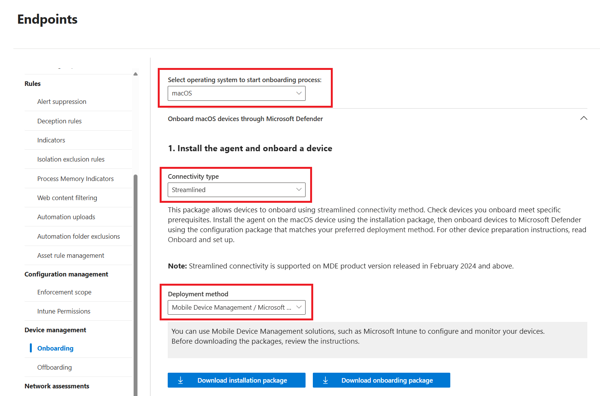

# Deploy Microsoft Defender for Endpoint on macOS with Microsoft Intune

**Applies to:**

- [Microsoft Defender for Endpoint on macOS](microsoft-defender-endpoint-mac.md)
- [Microsoft Defender for Endpoint Plan 1](https://go.microsoft.com/fwlink/p/?linkid=2154037)
- [Microsoft Defender for Endpoint Plan 2](https://go.microsoft.com/fwlink/p/?linkid=2154037)
- [Microsoft Defender for business](https://www.microsoft.com/security/business/endpoint-security/microsoft-defender-business)

This article describes how to deploy Microsoft Defender for Endpoint on macOS through Microsoft Intune.

## Prerequisites and system requirements

Before you get started, see [the main Microsoft Defender for Endpoint on macOS page](microsoft-defender-endpoint-mac.md) for an overview of Microsoft Defender for Endpoint on macOS, including its capabilities and features. It also includes links to additional resources for more information. For a description of prerequisites and system requirements for the current software version, see [Microsoft Defender for Endpoint on MacOS prerequisites](/defender-endpoint/microsoft-defender-endpoint-mac-prerequisites).

[!INCLUDE [side-by-side-scenarios](includes/side-by-side-scenarios.md)]

## Overview

The following table summarizes the steps to deploy and manage Microsoft Defender for Endpoint on macOS via Microsoft Intune. See the following table for more detailed steps:

|Step |Sample file name  |Bundle identifier  |
|---------|---------|---------|
|Approve system extension|`sysext.mobileconfig`|N/A|
|Network extension policy|`netfilter.mobileconfig`|N/A|
|Full Disk Access|`fulldisk.mobileconfig`|`com.microsoft.wdav.epsext`|
|Microsoft Defender for Endpoint configuration settings <br/><br/>If you're planning to run non-Microsoft antivirus on macOS, set `passiveMode` to `true`.|`MDE_MDAV_and_exclusion_settings_Preferences.xml`|`com.microsoft.wdav`|
|Background services|`background_services.mobileconfig`|N/A|
|Configure Microsoft Defender for Endpoint notifications|`notif.mobileconfig`|`com.microsoft.wdav.tray`|
|Accessibility settings|`accessibility.mobileconfig`|`com.microsoft.dlp.daemon`|
|Bluetooth|`bluetooth.mobileconfig`|`com.microsoft.dlp.agent`|
|Configure Microsoft AutoUpdate (MAU)|`com.microsoft.autoupdate2.mobileconfig`|`com.microsoft.autoupdate2`|
|Device Control|`DeviceControl.mobileconfig`|N/A|
|Data Loss Prevention|`DataLossPrevention.mobileconfig`|N/A|
|Download the onboarding package|`WindowsDefenderATPOnboarding__MDATP_wdav.atp.xml`|`com.microsoft.wdav.atp`|
|Deploy the Microsoft Defender for Endpoint on macOS application|`Wdav.pkg`|N/A|

## Create system configuration profiles

The next step is to create system configuration profiles that Microsoft Defender for Endpoint needs.
Open the [Microsoft Intune admin center](https://go.microsoft.com/fwlink/?linkid=2109431)

### Step 1: Approve system extensions

1. In the [Intune admin center](https://intune.microsoft.com/#home), go to **Devices**, and under **Manage Devices**, select **Configuration**.

1. Under Configuration tab, On the **Policies** tab, select **+ Create** > **+ New Policy**. 

1. Under **Platform**, select **macOS**.

1. Under **Profile type**, select **Settings catalog**.

1. Select **Create**.

1. On the **Basics** tab, **Name** the profile and enter a **Description.** Then select **Next**.

1. On the **Configuration settings** tab**,** select **+ Add settings.**

1. In the **Settings picker**, expand the **System Configuration** category, and then select **System Extensions** and check **Allowed System Extensions**.
   
1. Close the Settings picker, and then select **+ Edit instance**. 

1. Configure the following entries in the **Allowed system extensions** section, then select **Save,** then select **Next.**

   |Allowed System Extensions|Team Identifier|
   |---|---|
   |`com.microsoft.wdav.epsext`|`UBF8T346G9`|
   |`com.microsoft.wdav.netext`|`UBF8T346G9`|

   :::image type="content" alt-text="Screenshot showing allowed system extensions" source="media/mac-install-with-intune/image003.png" lightbox="media/mac-install-with-intune/image003.png":::

1. On the **Scopes** tab, (optional) select scope tags, then select **Next.**

1. On the **Assignments** tab, assign the profile to a group where the macOS devices or users are located, then select **Next**.

1. Review the configuration profile, then select **Create**.

### Step 2: Network filter

As part of the Endpoint Detection and Response capabilities, Microsoft Defender for Endpoint on macOS inspects socket traffic and reports this information to the Microsoft 365 Defender portal. The following policy allows the network extension to perform this functionality.

Download **[netfilter.mobileconfig](https://raw.githubusercontent.com/microsoft/mdatp-xplat/master/macos/mobileconfig/profiles/netfilter.mobileconfig)** from [GitHub repository](https://github.com/microsoft/mdatp-xplat/tree/master/macos/mobileconfig/profiles).

> [!IMPORTANT]
> Only one `.mobileconfig` (plist) for Network Filter is supported. Adding multiple Network Filters leads to network connectivity issues on macOS. This issue isn't specific to Defender for Endpoint on macOS.

To configure your network filter:

1. In the [Intune admin center](https://intune.microsoft.com/#home), go to **Devices**, and under **Manage Devices**, select **Configuration**.

1. On the **Policies** tab, select **Create** > **New Policy**. 

1. Under **Platform**, select **macOS**.

1. Under **Profile type**, select **Templates**.

1. Under **Template name**, select **Custom**.

1. Select **Create**.

1. On the **Basics** tab, **Name** the profile, (for example: MacOS Network Filter), and enter a **Description**, then select **Next**.

1. On the **Configuration settings** tab, enter a **Custom configuration profile** name.

1. Choose a **Deployment channel**.

1. Select the [netfilter.mobileconfig](https://raw.githubusercontent.com/microsoft/mdatp-xplat/master/macos/mobileconfig/profiles/netfilter.mobileconfig) **Configuration profile file** downloaded earlier, then select **Next**.

1. On the **Scope Tags** tab, (optional) select scope tags, then select **Next.**

1. On the **Assignments** tab, assign the profile to a group where the macOS devices and/or users are located, then select **Next**.

1. Review the configuration profile, then select **Create**.

### Step 3: Full Disk Access

> [!NOTE]
> With macOS Catalina (10.15) or newer, in order to provide privacy for the end-users, it created the **FDA** (Full Disk Access). Enabling **TCC** (Transparency, Consent & Control) through a Mobile Device Management solution such as [Intune](mac-install-with-intune.md), eliminates the risk of Defender for Endpoint losing **Full Disk Access** Authorization to function properly.
>
> This configuration profile grants Full Disk Access to Microsoft Defender for Endpoint. If you previously configured Microsoft Defender for Endpoint through Intune, we recommend you update the deployment with this configuration profile.

Download [**fulldisk.mobileconfig**](https://raw.githubusercontent.com/microsoft/mdatp-xplat/master/macos/mobileconfig/profiles/fulldisk.mobileconfig) from [GitHub repository](https://github.com/microsoft/mdatp-xplat/tree/master/macos/mobileconfig/profiles).

To configure Full Disk Access:

1. In the [Intune admin center](https://intune.microsoft.com/#home), go to **Devices**, and under **Manage Devices**, select **Configuration**.

1. On the **Policies** tab, select **Create** > **New Policy**. 

1. Under **Platform**, select **macOS**.

1. Under **Profile type**, select **Templates**.

1. Under **Template name**, select **Custom**.

1. Select **Create**.

1. On the **Basics** tab, **Name** the profile, (for example: MacOS Full disk access), and enter a **Description**, then select **Next**.

1. On the **Configuration settings** tab, enter a **Custom configuration profile** name.

1. Choose a **Deployment channel**.

1. Select the [fulldisk.mobileconfig](https://raw.githubusercontent.com/microsoft/mdatp-xplat/master/macos/mobileconfig/profiles/fulldisk.mobileconfig) **Configuration profile file** downloaded earlier, then select **Next**.

1. On the **Scope Tags** tab, (optional) select scope tags, then select **Next.**

1. On the **Assignments** tab, assign the profile to a group where the macOS devices and/or users are located, then select **Next**.

1. Review the configuration profile, then select **Create**.

> [!NOTE]
> Full Disk Access granted through Apple MDM Configuration Profile isn't reflected in **System Settings > Privacy & Security > Full Disk Access**.

### Step 4: Background services

> [!CAUTION]
> macOS 13 (Ventura) contains new privacy enhancements. Beginning with this version, by default, applications can't run in background without explicit consent. Microsoft Defender for Endpoint must run its daemon process in background. This configuration profile grants Background Service permission to Microsoft Defender for Endpoint. If you previously configured Microsoft Defender for Endpoint through Microsoft Intune, we recommend you update the deployment with this configuration profile.

Download **[background_services.mobileconfig](https://raw.githubusercontent.com/microsoft/mdatp-xplat/master/macos/mobileconfig/profiles/background_services.mobileconfig)** from [GitHub repository](https://github.com/microsoft/mdatp-xplat/tree/master/macos/mobileconfig/profiles).

To configure background services:

1. In the [Intune admin center](https://intune.microsoft.com/#home), go to **Devices**, and under **Manage Devices**, select **Configuration**.

1. On the **Policies** tab, select **Create** > **New Policy**. 

1. Under **Platform**, select **macOS**.

1. Under **Profile type**, select **Templates**.

1. Under **Template name**, select **Custom**.

1. Select **Create**.

1. On the **Basics** tab, **Name** the profile, (for example: MacOS background services), and enter a **Description**, then select **Next**.

1. On the **Configuration settings** tab, enter a **Custom configuration profile** name.

1. Choose a **Deployment channel**.

1. Select the [background_services.mobileconfig](https://raw.githubusercontent.com/microsoft/mdatp-xplat/master/macos/mobileconfig/profiles/background_services.mobileconfig) **Configuration profile file** downloaded earlier, then select **Next**.

1. On the **Scope Tags** tab, (optional) select scope tags, then select **Next.**

1. On the **Assignments** tab, assign the profile to a group where the macOS devices and/or users are located, then select **Next**.

1. Review the configuration profile, then select **Create**.

### Step 5: Notifications

This profile is used to allow Microsoft Defender for Endpoint on macOS and Microsoft AutoUpdate to display notifications in UI.

Download **[notif.mobileconfig](https://raw.githubusercontent.com/microsoft/mdatp-xplat/master/macos/mobileconfig/profiles/notif.mobileconfig)** from [GitHub repository](https://github.com/microsoft/mdatp-xplat/tree/master/macos/mobileconfig/profiles).

To turn off notifications for the end users, you can change **Show NotificationCenter** from `true` to `false` in [notif.mobileconfig](https://raw.githubusercontent.com/microsoft/mdatp-xplat/master/macos/mobileconfig/profiles/notif.mobileconfig).

:::image type="content" source="media/image.png" alt-text="Screenshot showing notif.mobileconfig with ShowNotificationCenter set to True.":::

To configure notifications:

1. In the [Intune admin center](https://intune.microsoft.com/#home), go to **Devices**, and under **Manage Devices**, select **Configuration**.

1. On the **Policies** tab, select **Create** > **New Policy**. 

1. Under **Platform**, select **macOS**.

1. Under **Profile type**, select **Templates**.

1. Under **Template name**, select **Custom**.

1. Select **Create**.

1. On the **Basics** tab, **Name** the profile, (for example: MacOS Notifications consent), and enter a **Description**, then select **Next**.

1. On the **Configuration settings** tab, enter a **Custom configuration profile** name.

1. Choose a **Deployment channel**.

1. Select the [notif.mobileconfig](https://raw.githubusercontent.com/microsoft/mdatp-xplat/master/macos/mobileconfig/profiles/notif.mobileconfig) **Configuration profile file** downloaded earlier, then select **Next**.

1. On the **Scope Tags** tab, (optional) select scope tags, then select **Next.**

1. On the **Assignments** tab, assign the profile to a group where the macOS devices and/or users are located, then select **Next**.

1. Review the configuration profile, then select **Create**.

### Step 6: Accessibility settings

This profile is used to allow Microsoft Defender for Endpoint on macOS to access the accessibility settings on Apple macOS High Sierra (10.13.6) and newer.

Download [accessibility.mobileconfig](https://raw.githubusercontent.com/microsoft/mdatp-xplat/refs/heads/master/macos/mobileconfig/profiles/accessibility.mobileconfig) from [GitHub repository](https://github.com/microsoft/mdatp-xplat/tree/master/macos/mobileconfig/profiles).

1. In the [Intune admin center](https://intune.microsoft.com/#home), go to **Devices**, and under **Manage Devices**, select **Configuration**.

1. On the **Policies** tab, select **Create** > **New Policy**. 

1. Under **Platform**, select **macOS**.

1. Under **Profile type**, select **Templates**.

1. Under **Template name**, select **Custom**.

1. Select **Create**.

1. On the **Basics** tab, **Name** the profile, (for example: MacOS Accessibility settings), and enter a **Description**, then select **Next**.

1. On the **Configuration settings** tab, enter a **Custom configuration profile** name.

1. Choose a **Deployment channel**.

1. Select the [accessibility.mobileconfig](https://raw.githubusercontent.com/microsoft/mdatp-xplat/refs/heads/master/macos/mobileconfig/profiles/accessibility.mobileconfig) **Configuration profile file** downloaded earlier, then select **Next**.

1. On the **Scope Tags** tab, (optional) select scope tags, then select **Next.**

1. On the **Assignments** tab, assign the profile to a group where the macOS devices and/or users are located, then select **Next**.

1. Review the configuration profile, then select **Create**.

### Step 7: Bluetooth permissions

> [!CAUTION]
> macOS 14 (Sonoma) contains new privacy enhancements. Beginning with this version, by default, applications can't access Bluetooth without explicit consent. Microsoft Defender for Endpoint uses it if you configure Bluetooth policies for Device Control.

Download **[bluetooth.mobileconfig](https://raw.githubusercontent.com/microsoft/mdatp-xplat/refs/heads/master/macos/mobileconfig/profiles/bluetooth.mobileconfig)** from [GitHub repository](https://github.com/microsoft/mdatp-xplat/tree/master/macos/mobileconfig/profiles) and use the same workflow as in [Step 6: Accessibility settings](#step-6-accessibility-settings) to enable Bluetooth access.

1. In the [Intune admin center](https://intune.microsoft.com/#home), go to **Devices**, and under **Manage Devices**, select **Configuration**.

1. On the **Policies** tab, select **Create** > **New Policy**. 

1. Under **Platform**, select **macOS**.

1. Under **Profile type**, select **Templates**.

1. Under **Template name**, select **Custom**.

1. Select **Create**.

1. On the **Basics** tab, **Name** the profile, (for example: MacOS Bluetooth consent), and enter a **Description**, then select **Next**.

1. On the **Configuration settings** tab, enter a **Custom configuration profile** name.

1. Choose a **Deployment channel**.

1. Select the [bluetooth.mobileconfig](https://raw.githubusercontent.com/microsoft/mdatp-xplat/refs/heads/master/macos/mobileconfig/profiles/bluetooth.mobileconfig) **Configuration profile file** downloaded earlier, then select **Next**.

1. On the **Scope Tags** tab, (optional) select scope tags, then select **Next.**

1. On the **Assignments** tab, assign the profile to a group where the macOS devices and/or users are located, then select **Next**.

1. Review the configuration profile, then select **Create**.

> [!NOTE]
> Bluetooth granted through Apple MDM Configuration Profile isn't reflected in System Settings => Privacy & Security => Bluetooth.

### Step 8: Microsoft AutoUpdate

This profile is used to update the Microsoft Defender for Endpoint on macOS via Microsoft AutoUpdate (MAU). If you're deploying Microsoft Defender for Endpoint on macOS, you have the options to get an updated version of the application (Platform Update) that are in the different channels mentioned here:

- Beta (Insiders-Fast)
- Current channel (Preview, Insiders-Slow)
- Current channel (Production)

For more information, see [Deploy updates for Microsoft Defender for Endpoint on macOS](mac-updates.md).

Download **[com.microsoft.autoupdate2.mobileconfig](https://raw.githubusercontent.com/microsoft/mdatp-xplat/refs/heads/master/macos/settings/microsoft_auto_update/com.microsoft.autoupdate2.mobileconfig)** from the [GitHub repository](https://github.com/microsoft/mdatp-xplat/tree/master/macos/mobileconfig/profiles).

> [!NOTE]
> The sample `com.microsoft.autoupdate2.mobileconfig` from the GitHub repository is set to Current Channel (Production).

1. In the [Intune admin center](https://intune.microsoft.com/#home), go to **Devices**, and under **Manage Devices**, select **Configuration**.

1. On the **Policies** tab, select **Create** > **New Policy**. 

1. Under **Platform**, select **macOS**.

1. Under **Profile type**, select **Templates**.

1. Under **Template name**, select **Custom**.

1. Select **Create**.

1. On the **Basics** tab, **Name** the profile, (for example, `macOS Microsoft Auto-Update`), and enter a **Description**, then select **Next**.

1. On the **Configuration settings** tab, enter a **Custom configuration profile** name.

1. Choose a **Deployment channel**.

1. Select the [com.microsoft.autoupdate2.mobileconfig](https://raw.githubusercontent.com/microsoft/mdatp-xplat/refs/heads/master/macos/settings/microsoft_auto_update/com.microsoft.autoupdate2.mobileconfig) **Configuration profile file** downloaded earlier, then select **Next**.

1. On the **Scope Tags** tab, (optional) select scope tags, then select **Next.**

1. On the **Assignments** tab, assign the profile to a group where the macOS devices and/or users are located, then select **Next**.

1. Review the configuration profile, then select **Create**.

### Step 9: Microsoft Defender for Endpoint configuration settings

In this step, you will configure anti-malware and EDR policies, using either the Microsoft Defender portal (Step 9a.) **OR** the Microsoft Intune portal (Step 9b.), depending on your preference or your organization requirements.

> [!NOTE]
> Complete **only one** of the following steps (9a. OR 9b.)

#### 9a. Set policies using the Microsoft Defender portal

Set policies using the Microsoft Defender portal by following these steps:

1. Go through [Configure Microsoft Defender for Endpoint in Intune](/mem/intune/protect/advanced-threat-protection-configure) before setting the security policies using Microsoft Defender for Endpoint Security Settings Management.

2. In the [Microsoft Defender portal](https://sip.security.microsoft.com/homepage), go to **Configuration management** > **Endpoint security policies** > **Mac policies** > **Create new policy**.

3. Under **Select Platform**, select **macOS**.

1. Under **Select Template**, select the **Microsoft Defender Antivirus** template (or the **Endpoint detection and response** if you are repeating the actions as per 9. below) then select **Create Policy**.

1. Specify a name (for example: Microsoft Defender Anti-Virus Policy (or EDR Policy)) and description for the policy, then select **Next**.

1. On the **Configuration settings** tab, select the appropriate settings for your organization, then select **Next**.

1. On the **Assignments** tab, assign the profile to a group where the macOS devices and/or users are located, then select **Next**.

1. On the **Review** tab, select **Save**.

1. Repeat actions from 2. to 8. above to create an **Endpoint detection and response** (EDR) policy.

#### 9b. Set policies using Microsoft Intune 

Set policies using Microsoft Defender Portal by implementing the following instructions:

To create this profile, copy the code for the [Intune recommended profile](/defender-endpoint/mac-preferences#intune-recommended-profile) (recommended) or the [Intune full profile](/defender-endpoint/mac-preferences#intune-full-profile) (for advanced scenarios), and save the file as `com.microsoft.wdav.xml`.

1. In the [Intune admin center](https://intune.microsoft.com/#home), go to **Devices**, and under **Manage Devices**, select **Configuration**.

1. On the **Policies** tab, select **Create** > **New Policy**. 

1. Under **Platform**, select **macOS**.

1. Under **Profile type**, select **Templates**.

1. Under **Template name**, select **Custom**.

1. Select **Create**.

1. On the **Basics** tab, **Name** the profile, (for example, `macOS wdav preferences`), and enter a **Description**, then select **Next**.

1. On the **Configuration settings** tab, enter the **Custom configuration profile** **name** `com.microsoft.wdav`

1. Choose a **Deployment channel**.

1. Select the `com.microsoft.wdav.xml` Configuration profile file created earlier, then select **Next.**

1. On the **Scope Tags** tab, (optional) select scope tags, then select **Next.**

1. On the **Assignments** tab, assign the profile to a group where the macOS devices and/or users are located, then select **Next**.

1. Review the configuration profile, then select **Create**.

> [!CAUTION]
> You must enter the correct **custom configuration profile name**; otherwise, these preferences won't be recognized by Microsoft Defender for Endpoint.

For more information, see [Set preferences for Microsoft Defender for Endpoint on Mac](mac-preferences.md).

For more information about managing security settings, see:

- [Manage Microsoft Defender for Endpoint on devices with Microsoft Intune](/mem/intune/protect/mde-security-integration?pivots=mdssc-ga)
- [Manage security settings for Windows, macOS, and Linux natively in Defender for Endpoint](https://techcommunity.microsoft.com/t5/microsoft-defender-for-endpoint/manage-security-settings-for-windows-macos-and-linux-natively-in/ba-p/3870617)

### Step 10: Network protection for Microsoft Defender for Endpoint on macOS (optional)

The **Network protection** setting is included in the **Microsoft Defender Antivirus** template created in step 9.

For more information about Network Protection for Microsoft Defender for Endpoint on MacOS see [Network protection for MacOS](/defender-endpoint/network-protection-macos)

### Step 11: Device Control for Microsoft Defender for Endpoint on macOS (optional)

The Device Control setting is included in the MacOS Full disk access template created in step 3.

For more information about Device Control for Microsoft Defender for Endpoint on macOS see [Device Control for MacOS](/defender-endpoint/mac-device-control-overview)

> [!IMPORTANT]
> You should create and deploy the configuration profiles in the order specified (steps 1-11) for a successful system configuration.

### Step 12: Publish the Microsoft Defender application

> [!IMPORTANT]
> The Microsoft Defender app for macOS splits features for both Microsoft Defender for Endpoint and Microsoft Purview Endpoint Data Loss Prevention, if you are also planning to onboard MacOS devices to Purview (Step 18), ensure Device Monitoring is turned on **at this stage**. To enable Purview Device Monitoring on the [Microsoft Purview Portal](https://purview.microsoft.com) go to **Settings > Devices.**

This step enables deploying Microsoft Defender for Endpoint to machines enrolled in Microsoft Intune.

1. In the [Microsoft Intune admin center](https://go.microsoft.com/fwlink/?linkid=2109431), open **Apps**.

   :::image type="content" source="media/mdatp-8-app-before.png" alt-text="Screenshot that shows the application's overview page." lightbox="media/mdatp-8-app-before.png":::
   
1. Expand **Platforms**, select **macOS,** then select **+Create** 

1. Under **App type**, select **Microsoft Defender for Endpoint >** **macOS**, then select **Select**.

   :::image type="content" source="media/mdatp-9-app-type.png" alt-text="Screenshot that shows the specific application type." lightbox="media/mdatp-9-app-type.png":::
   
1. On the **App information**, keep the default values and select **Next**.

   :::image type="content" source="media/mdatp-10-properties.png" alt-text="Screenshot that shows the application properties page." lightbox="media/mdatp-10-properties.png":::
   
1. On the **Scope Tags** tab, (optional) select scope tags, then select **Next.**

1. On the **Assignments** tab, assign the profile to a group where the macOS devices and/or users are located, then select **Next**.

      :::image type="content" source="media/mdatp-11-assignments.png" alt-text="Screenshot that shows the Intune assignments information page." lightbox="media/mdatp-11-assignments.png":::

1. On the **Review+Create** tab, select **Create**. 

      :::image type="content" source="media/mdatp-12-applications.png" alt-text="Screenshot that shows the application lists page." lightbox="media/mdatp-12-applications.png":::

      For more information, see [Add Microsoft Defender for Endpoint to macOS devices using Microsoft Intune](/mem/intune/apps/apps-advanced-threat-protection-macos).


### Step 13: Download the Microsoft Defender for Endpoint onboarding package

To download the onboarding package from the Microsoft Defender portal:

1. In the [Microsoft Defender portal](https://sip.security.microsoft.com/homepage), select **Settings** > **Endpoints** > **Device management** > **Onboarding**.

1. On the **Select operating system to start the onboarding process** drop-down, select **macOS.**

1. On the **Deployment method** drop-down, select **Mobile Device Management / Microsoft Intune**.

   

1. Select **Download onboarding package**. Save it as _GatewayWindowsDefenderATPOnboardingPackage.zip_ to the same directory.

1. Extract the contents of the .zip file:

   ```bash
   unzip GatewayWindowsDefenderATPOnboardingPackage.zip
   ```

   ```console
   Archive:  GatewayWindowsDefenderATPOnboardingPackage.zip
   warning:  GatewayWindowsDefenderATPOnboardingPackage.zip appears to use backslashes as path separators
    inflating: intune/kext.xml
    inflating: intune/WindowsDefenderATPOnboarding.xml
    inflating: jamf/WindowsDefenderATPOnboarding.plist
   ```

### Step 14: Deploy the Microsoft Defender for Endpoint onboarding package for MacOS

This profile contains license information for Microsoft Defender for Endpoint. 

1. In the [Intune admin center](https://intune.microsoft.com/#home), go to **Devices**, and under **Manage Devices**, select **Configuration**.

1. On the **Policies** tab, select **Create** > **New Policy**. 

1. Under **Platform**, select **macOS**.

1. Under **Profile type**, select **Templates**.

1. Under **Template name**, select **Custom**.

1. Select **Create**.

1. On the **Basics** tab, **Name** the profile, (for example: MDE onboarding for macOS), and enter a **Description**, then select **Next**.

1. On the **Configuration settings** tab, enter a **Custom configuration profile** **name.**

1. Choose a **Deployment channel**.

1. Select the *WindowsDefenderATPOnboarding.xml* Configuration profile file created earlier, then select **Next.**

1. On the **Scope Tags** tab, (optional) select scope tags, then select **Next.**

1. On the **Assignments** tab, assign the profile to a group where the macOS devices and/or users are located, then select **Next**.

1. Review the configuration profile, then select **Create**.

### Step 15: Check Device and Configuration status

#### Step 15a. View Status

There are multiple ways to look at this information in the [Microsoft Intune admin center](https://intune.microsoft.com/#home), including monitoring and reports per device, user, configuration policies and more. Here's an example:

1. In the [Intune admin center](https://intune.microsoft.com/#home), go to **Devices**, and under **Manage Devices**, select **Configuration**.

1. On the **Policies** tab select a policy, then on the **Device and user check-in status** select **View Report**.

#### Step 15b. Client device setup

1. Follow the steps outlined in [Enroll your macOS device using the Company Portal app](/mem/intune/user-help/enroll-your-device-in-intune-macos-cp)

1. Confirm device management.

   
   
1. Select **Open System Preferences**, locate **Management Profile** on the list, and select **Approve...**. Your Management Profile would be displayed as **Verified**:

   
   
1. Select **Continue** and complete the enrollment.

   You might now enroll more devices. You can also enroll them later, after finishing the provisioning system configuration and application packages.

1. In Intune, select **Devices** > **All devices**. Here you can see your device among the listed:

   
   
#### Step 15c. Verify client device state

1. After the configuration profiles are deployed to your devices, open **System Settings > General > Device Management** on your MacOS device.

1. Verify that all the configuration profiles are present and installed:

   - `accessibility.mobileconfig`
   - `background_services.mobileconfig`
   - `bluetooth.mobileconfig`
   - `com.microsoft.autoupdate2.mobileconfig`
   - `fulldisk.mobileconfig`
   - Management Profile (this is the Intune system profile)
   - `WindowsDefenderATPOnboarding.xml` (this is the Defender for Endpoint onboarding package for macOS)
   - `netfilter.mobileconfig`
   - `notif.mobileconfig`
      
1. You should also see the **Microsoft Defender** icon in the top-right corner.

   
   
### Step 16: Verify anti-malware detection

See the following article to test for an anti-malware detection review: [Antivirus detection test for verifying device's onboarding and reporting services](validate-antimalware.md)

### Step 17: Verifying EDR detection

See the following article to test for an EDR detection review: [EDR detection test for verifying device onboarding and reporting services](edr-detection.md)

### Step 18: Microsoft Purview Data Loss Prevention (DLP) for Endpoint on MacOS (strongly recommended)

See [Get started with endpoint data loss prevention](/purview/endpoint-dlp-getting-started).

## Troubleshooting

Issue: No license found.

Cause: Onboarding has not completed. 

Resolution: Ensure you have completed steps 13 and 14 above.

## Logging installation issues

See [Logging installation issues](mac-resources.md#logging-installation-issues) for information on how to find the automatically generated log created by the installer, when an error occurs.

For information on troubleshooting procedures, see:

- [Troubleshoot system extension issues in Microsoft Defender for Endpoint on macOS](mac-support-sys-ext.md)
- [Troubleshoot installation issues for Microsoft Defender for Endpoint on macOS](mac-support-install.md)
- [Troubleshoot license issues for Microsoft Defender for Endpoint on macOS](mac-support-license.md)
- [Troubleshoot cloud connectivity issues for Microsoft Defender for Endpoint on macOS](troubleshoot-cloud-connect-mdemac.md)
- [Troubleshoot performance issues for Microsoft Defender for Endpoint on macOS](mac-support-perf.md)

## Uninstallation

See [Uninstalling](mac-resources.md#uninstalling) for details on how to remove Microsoft Defender for Endpoint on macOS from client devices.

