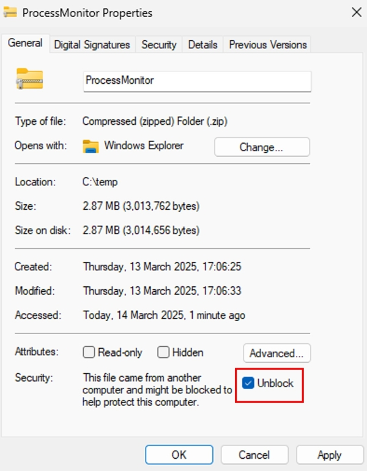
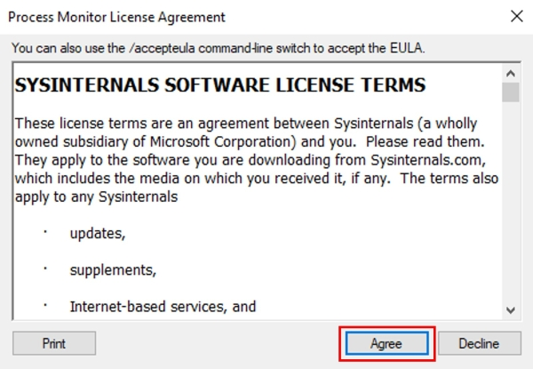
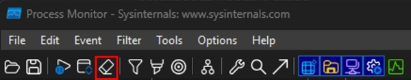
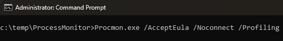
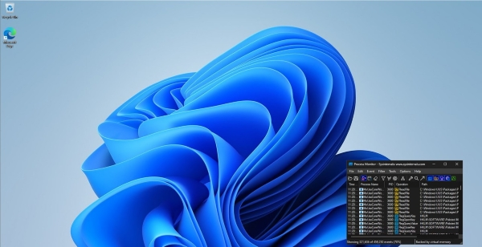
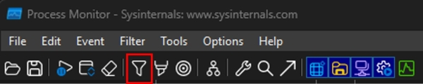
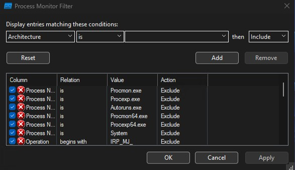
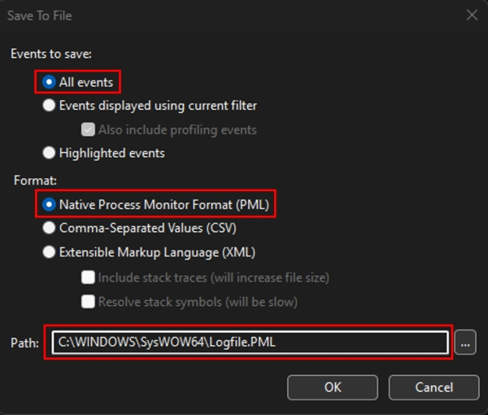

# Troubleshoot Microsoft Defender Antivirus performance issues with Process Monitor

> [!TIP]
> First, review common reasons for performance issues, such as high CPU usage. See **[Troubleshoot performance issues related to Microsoft Defender Antivirus real-time protection (rtp) or scans (scheduled or on-demand](/defender-endpoint/troubleshoot-performance-issues)**.
> Then, run the [Microsoft Defender Antivirus Performance Analyzer](/defender-endpoint/tune-performance-defender-antivirus). This tool will help identify the cause of high CPU usage in Microsoft Defender Antivirus, whether it's the Antimalware Service Executable, the Microsoft Defender Antivirus service, or MsMpEng.exe.
> If the Microsoft Defender Antivirus Performance Analyzer doesn't identify the root cause of the high CPU utilization, proceed with running **[Processor Monitor](/defender-endpoint/troubleshoot-av-performance-issues-with-procmon)**.
> The final tool in your toolkit to run is [Windows Performance Recorder UI (WPRUI) or Windows Performance Recorded (WPR command-line)](/defender-endpoint/troubleshoot-av-performance-issues-with-wprui).

## Capture process logs using Process Monitor

Process Monitor (ProcMon) is an advanced monitoring tool that provides real-time data on processes. It can be used to capture performance issues, such as high CPU usage, and to monitor application compatibility scenarios as they occur.

You can capture a Process Monitor (ProcMon) trace by using the MDE Client Analyzer or by using a manual process.

### Using the MDE Client Analyzer

1. Download the [MDE Client Analyzer](/defender-endpoint/overview-client-analyzer).

2. Run the MDE Client Analyzer using [Live Response or locally](/defender-endpoint/run-analyzer-windows).

   > [!TIP]
   > Before starting the trace, please make sure that the issue is reproducible. Additionally, close any applications that do not contribute to the reproduction of the issue.

3. Run the MDE Client Analyzer with the `-c` and `-v` switches:

   ```powershell
   C:\Work\tools\MDEClientAnalyzer\MDEClientAnalyzer.cmd -c -v
   ```

### Manual process

1. Download [Process Monitor v4.01](/sysinternals/downloads/procmon) to a folder like `C:\temp`.

2. To remove the file's mark of the web:

   1. Right-click **ProcessMonitor.zip** and select **Properties**.
      
   2. Under the *General* tab, look for *Security*.
      
   3. Check the box beside **Unblock**.
      
   4. Select **Apply**.
   
   
   
3. Unzip the file in `C:\temp` so that the folder path is `C:\temp\ProcessMonitor`.

4. Copy **Procmon.exe** to the Windows client or Windows server you're troubleshooting.

   > [!TIP]
   > Before running ProcMon, make sure all other applications not related to the high CPU usage issue are closed. Taking this step helps to minimize the number of processes to check.
   
5. You can launch ProcMon in two ways: using Procmon.exe or command line.

   - To use [Procmon.exe](/sysinternals/downloads/procmon), download it, and open it as an administrator.

      1. If this is your first time using ProcMon, click **Agree** to accept the Process Monitor License Agreement.

         

      2. Since logging starts automatically, stop the capture by selecting the **Capture** button or pressing **Ctrl+E**.

         .jpg)

      3. To confirm the capture has stopped, look for a pause icon on the **Capture** button, then delete the logged entries by selecting the **Clear** button or pressing **Ctrl+X**.

         .jpg)

         
      
   - To use command line, open Command Prompt as an administrator. Then, run the following command:

      
      
   > [!TIP]
   > Make the ProcMon window as small as possible when capturing data so you can easily start and stop the trace
   
6. Set filters by selecting the **Filter** icon. Standard filters are set by default. You can also filter the results after the capture is complete. If you applied any filters, click **Apply** and then **OK**.

   

   
   
7. To start the capture, select the **Capture** button again.

8. Reproduce the problem.

   > [!TIP]
   > Wait for the problem to be reproduced, then note the timestamp when the trace begins.
   
9. After capturing two to four minutes of process activity during high CPU usage, stop the capture by clicking the **Capture** button.

10. To save the capture with a unique name in the `.pml` format, go to **File** then click **Save...**. Ensure you select the radio buttons **All events** and **Native Process Monitor Format (PML)**.

      
   
11. For better tracking, change the default path from `C:\temp\ProcessMonitor\LogFile.PML` to `C:\temp\ProcessMonitor\%ComputerName%_LogFile_MMDDYEAR_Repro_of_issue.PML` where:

   - `%ComputerName%` is the device name
   - `MMDDYEAR` is the month, day, and year
   - `Repro_of_issue` is the name of the issue you're trying to reproduce

   > [!TIP]
   > If you have a working system, you might want to get a sample log to compare.

12. Zip the `.pml` file and submit it to Microsoft Support.
