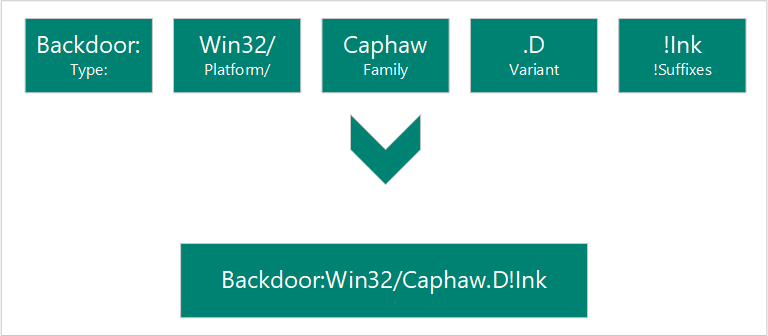

# Malware names

We name the malware and unwanted software that we detect according to the Computer Antivirus Research Organization (CARO) malware naming scheme. The scheme uses the following format:



When our analysts research a particular threat, they determine what each of the components name is.

## Type

Type describes what the malware does on your computer. The following are the different types of malware that Microsoft products detect.

### Malware

Following are the types of malware that Microsoft detects. To know more about how Microsoft defines malware, see [How Microsoft identifies malware and potentially unwanted applications - Malware](criteria.md#malware).

```
* Backdoor
* Constructor
* DDoS
* Exploit
* HackTool
* Joke
* Password Stealer (PWS)
* Ransom
* Rogue
* Spammer
* Spoofer
* Trojan
* TrojanClicker
* TrojanDownloader
* TrojanNotifier
* TrojanProxy
* TrojanSpy
* VirTool
* Virus
* Worm
```

### Unwanted software

Following are the types of unwanted software that Microsoft products detect. For more information on what unwanted software is and what is classified as unwanted software, see [Unwanted software](criteria.md#unwanted-software).

```
* Adware
* BrowserModifier
* Misleading
* MonitoringTool
* Program
* SoftwareBundler
* UwS
```

### Potentially unwanted applications

Following are the types of potentially unwanted applications (PUAs) that Microsoft products detect. To know what PUAs are, see [Potentially unwanted application (PUA)](criteria.md#potentially-unwanted-application-pua).

```
* PUA
* App
* PUAAdvertising
* PUATorrent
* PUAMiner
* PUAMarketing
* PUABundler
* PUADlManager
```
### Tampering software

Tampering software, detected as ***Tampering** are tools that can lower device security. To know more, see [Tampering software](criteria.md#tampering-software).

### Vulnerable software

Following are the types of vulnerable software that Microsoft products detect. Know more about this detection in [Vulnerable software](criteria.md#vulnerable-software).

```
* Vulnerable
* VulnerableDriver
```

### Other malware types

Microsoft also detects ***Behavior** and ***Tool** types of malware.

## Platforms

Platforms guide the malware to its compatible operating system (such as Windows, macOS, and Android). The platform's guidance is also used for programming languages and file formats.

### Operating systems
```
* AndroidOS: Android operating system
* DOS: MS-DOS platform
* EPOC: Psion devices
* FreeBSD: FreeBSD platform
* iOS: iPhone operating system
* Linux: Linux platform
* macOS: MAC 9.x platform or earlier
* macOS_X: macOS X or later
* OS2: OS2 platform
* Palm: Palm operating system
* Solaris: System V-based Unix platforms
* SunOS: Unix platforms 4.1.3 or lower
* SymbOS: Symbian operating system
* Unix: general Unix platforms
* Win16: Win16 (3.1) platform
* Win2K: Windows 2000 platform
* Win32: Windows 32-bit platform
* Win64: Windows 64-bit platform
* Win95: Windows 95, 98 and ME platforms
* Win98: Windows 98 platform only
* WinCE: Windows CE platform
* WinNT: WinNT
```

### Scripting languages
```
* ABAP: Advanced Business Application Programming scripts
* ALisp: ALisp scripts
* AmiPro: AmiPro script
* ANSI: American National Standards Institute scripts
* AppleScript: compiled Apple scripts
* ASP: Active Server Pages scripts
* AutoIt: AutoIT scripts
* BAS: Basic scripts
* BAT: Basic scripts
* CorelScript: Corelscript scripts
* HTA: HTML Application scripts
* HTML: HTML Application scripts
* INF: Install scripts
* IRC: mIRC/pIRC scripts
* Java: Java binaries (classes)
* JS: JavaScript scripts
* LOGO: LOGO scripts
* MPB: MapBasic scripts
* MSH: Monad shell scripts
* MSIL: .NET intermediate language scripts
* Perl: Perl scripts
* PHP: Hypertext Preprocessor scripts
* Python: Python scripts
* SAP: SAP platform scripts
* SH: Shell scripts
* VBA: Visual Basic for Applications scripts
* VBS: Visual Basic scripts
* WinBAT: Winbatch scripts
* WinHlp: Windows Help scripts
* WinREG: Windows registry scripts
```

### Macros
```
* A97M: Access 97, 2000, XP, 2003, 2007, and 2010 macros
* HE: macro scripting
* O97M: Office 97, 2000, XP, 2003, 2007, and 2010 macros - those that affect Word, Excel, and PowerPoint
* PP97M: PowerPoint 97, 2000, XP, 2003, 2007, and 2010 macros
* V5M: Visio5 macros
* W1M: Word1Macro
* W2M: Word2Macro
* W97M: Word 97, 2000, XP, 2003, 2007, and 2010 macros
* WM: Word 95 macros
* X97M: Excel 97, 2000, XP, 2003, 2007, and 2010 macros
* XF: Excel formulas
* XM: Excel 95 macros
```

### Other file types
```
* ASX: XML metafile of Windows Media .asf files
* HC: HyperCard Apple scripts
* MIME: MIME packets
* Netware: Novell Netware files
* QT: Quicktime files
* SB: StarBasic (StarOffice XML) files
* SWF: Shockwave Flash files
* TSQL: MS SQL server files
* XML: XML files
```
## Family

Grouping of malware based on common characteristics, including attribution to the same authors. Security software providers sometimes use different names for the same malware family.

## Variant letter

Used sequentially for every distinct version of a malware family. For example, the detection for the variant **".AF"** is created after the detection for the variant **".AE"**.

## Suffixes

A suffix that begins with **!** is an indicator used by Microsoft internally. 
